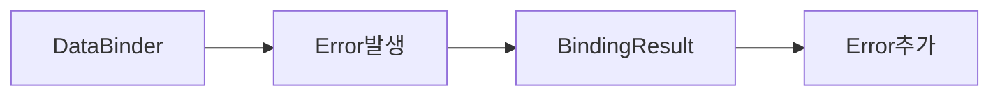
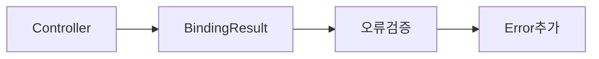
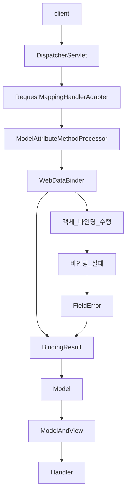
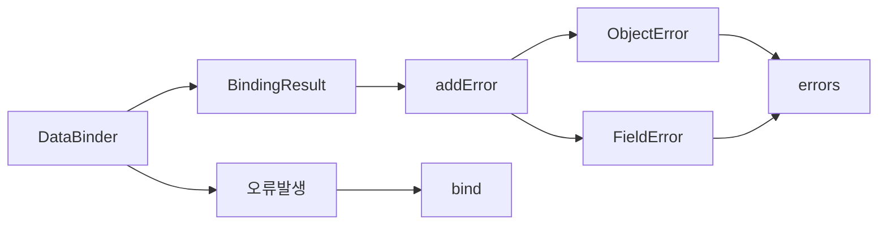

# 검증 (Validation)
## 개요
*  웹 개발에서 검증은 클라이언트 검증(Client-side Validation)과 서버 검증(Server-side Validation)으로 구분할 수 있으며 두 검증 모두 사용자의 데이터 입력 오류를 방지하고 보안을 강화하기 위해 중요한 역할을 한다.

### 기존의 Java 검증 방식
* 전통적인 Java에서는 데이터를 검증하기 위해 보통 조건문과 예외를 사용하여 각 필드에 대해 수동으로 검증 로직을 작성해야 한다.
* 복잡한 객체나 컬렉션의 검증을 위해서는 로직이 반복적으로 중첩되거나 별도의 검증 메서드를 생성해야 한다.
* 검증 로직의 일관성이 부족하고 코드의 양이 많아 유지보수성이 떨어진다.

### 스프링 검증 방식
* Spring은 다양한 방법과 도구를 통해 클라이언트로부터 입력된 데이터를 유효성 검증하고 데이터 무결성을 보장하고 있으며 애노테이션 기반 검증부터 커스텀 검증 구현까지 유연하고 강력한 검증 기능을 제공한다.
* 검증을 위한 도구로서 BindingResult, Errors, FieldError, ObjectError, MessageCodesResolver 등의 클래스를 제공하고 있다.

1) 폼 검증 (Form Validation)
   * @ModelAttribute를 폼 객체를 바인딩하고 객체의 유효성을 검사하며 검증 오류가 발생하면 BindingResult 객체에 오류 정보가 저장되며 뷰에 오류 메시지를 전달한다.
   * 스프링의 메시지 소스(MessageSource)를 활용하여 다국어 지원이나 커스텀 오류 메시지를 쉽게 관리할 수 있다.
2) Validator 인터페이스를 이용한 검증
   * Validator 인터페이스를 구현하여 커스텀 검증 로직을 작성할 수 있으며 이 방법은 애노테이션 기반 검증만으로는 처리할 수 없는 복잡한 검증 로직이 필요할 때 유용하다.
   * 검증 로직을 별도의 클래스로 분리하여 코드의 재사용성과 확장성을 높일 수 있다.
3) Bean Validation
   * Bean Validation(JSR-303/JSR-380) 표준을 기반으로 Hibernate Validator가 기본적으로 통합되어 있으며 이 방식은 객체의 필드에 어노테이션을 적용하여 유효성을 검사한다.
   * 스프링에서는 컨트롤러에서 @Valid 및 @Validated 애노테이션을 사용해 자동으로 검증을 수행할 수 있다. 
4) 커스텀 검증 애노테이션 (Custom Validation Annotation)
   * 스프링은 기본 제공 애노테이션 외에도 커스텀 검증 애노테이션을 구현할 수 있는 기능을 제공하며 ConstraintValidator 인터페이스를 구현하여 적용할 수 있다.

## BindingResult
### 개요
* 스프링의검증은 데이터 바인딩 과정과 밀접하게 연관되어 있다. 즉, 데이터 바인딩은 요청 데이터를 객체로 변환하는 과정인데 이 과정에서 데이터를 검증함으로써 애플리케이션의 안정성과 데이터 무결성을 보장하게 된다.

스프링에서는 크게 두 가지로 구분해서 검증이 이루어진다
1. 스프링은 데이터 바인딩 시 검증 로직을 자동으로 실행하도록 설계되었으며 BindingResult 통해 오류 정보 및 검증 결과를 저장하고 관리한다.
2. 컨트롤러에서 사용자가 직접 BindingResult를 통해 오류 데이터를 추가하고 검증을 진행할 수 있다.

* 스프링 검증


* 사용자 검증


### BindingResult 기본 전략
* 스프링의 BindingResult는 세 가지 기본 전략을 가진다
  1. 스프링은 데이터 바인딩 시 발생하는 모든 오류 정보를 자동으로 BindingResult의 errors 속성에 저장 한다.
  2. 사용자가 BindingResult 의 오류 정보를 활용하기 위해서는 컨트롤러 메서드 매개변수로 지정 해야 한다.
     * 매개변수로 지정 시 BindingResult는 @ModelAttribute 객체 바로 뒤에 위치해야 한다. 아래 코드에서 BindingResult는 user 객체 바로 다음에 와야 한다.
     * `public String method(@ModelAttribute User user, BindingResult bindingResult) {. . .}`
     * 매개변수로 지정하게 되면 객체 바인딩 오류가 나서 예외가 발생하더라도 컨트롤러는 정상으로 실행된다.
  3. BindingResult API를 사용해서 추가적인 검증을 진행하거나 검증 결과를 클라이언트에게 전달할 수 있다.

### BindingResult과 바인딩 객체
* DataBinder에 의해 바인딩이 완료되면 BindingResult는 바인딩 된 객체를 저장한다. 그리고 errors 속성은 비어 있는 상태다.

### BindingResult 기본
1. 바인딩 오류 발생 : BindingResult를 메서드에 선언하지 않는 경우
   * 스프링은 MethodArgumentNotValidException 예외를 발생시키고 요청한 컨트롤러는 실행되지 않는다.
   * 가장 기본이 되는 바인딩 오류는 타입 불일치이다 즉. 요청 데이터와 필드 타입이 서로 맞지 않아 바인딩이 실패 하는데 이때 내부적으로 TypeMismatchException 예외가 발생한다.
2. 바인딩 오류 발생 : BindingResult를 메서드에 선언한 경우
   * MethodArgumentNotValidException 예외를 건너뛰고 컨트롤러 메서드가 호출된다. 이유는 간단하다. BindingResult를 메서드에 선언했기 때문이다.
   * 스프링은 BindingResult의 메서드 선언 여부에 따라 요청을 계속 진행시킬지 아니면 MethodArgumentNotValidException 예외로 요청을 중단할지 결정한다.

### 바인딩 오류 흐름도


## BindingResult 사용자 정의 오류 추가 - FieldError, ObjectError
### 개요
* BindingResult은 문자 그대로 바인딩한 결과를 담는 객체라 할 수 있다. 즉 성공한 바인딩 결과와 실패한 오류 결과를 저장한다.(두 결과를 동시에 저장할 수 는 없다)
* 주 관심사는 오류 결과이며 그 오류 정보에 어떻게 접근할 수 있는지와 그리고 어떻게 커스텀하게 오류를 추가 할 수 있는지 관련 API 들을 살펴 보는 것이다.
* 참고로 BindingResult는 @ModelAttribute가 선언되어 있는 객체를 대상으로 오류를 검증한다. 단순 기본형이나 문자열은 검증 대상이 아니다. 이것은 DataBinder가 객체를 대상으로 바인딩을 시도한다는 사실을 알고 있다면 쉽게 이해가 갈 것이다.

### BindingResult API
`void addError(ObjectError error);`
* addError()는 필수 값 누락, 길이 제한 등 어떤 조건이 맞지 않을 경우 오류를 추가할수 있는 API 로서 인자 값으로는 ObjectError 와 FieldError 객체가 올 수 있다.
* 스프링은 바인딩 오류 시 내부적으로 BindingResult의 addError() API를 사용해서 오류 정보를 저장하고 있으며 이 때 FieldError 객체를 생성해서 전달한다.
* addError() API를 통해 추가된 FieldError, ObjectError는 BindingResult의 errors 속성에 저장 된다.



### 객체 오류(글로벌 오류) 와 필드 오류
* 스프링은 오류를 추가할 때 객체 오류(or 글로벌 오류)와 필드 오류로 구분하도록 API 를 설계했다.
* 객체 오류라는 것은 말 그대로 객체 수준에서 오류를 표현한다는 의미이고 필드 오류라는 것은 객체 보다 좀 더 구체적인 필드 수준에서 오류를 표현한다는 의미이다.
* 오류는 사용자나 클라이언트에게 이해하기 쉬운 문장으로 설명해야 되며 상황에 맞게끔 구체적인 오류와 종합적인 오류를 잘 조합해서 나타내야 한다.

### 오류 객체사용
* ObjectError 와 FieldError 는 생성자를 통해 오류 정보를 전달 받는다.

## BindingResult 입력값 보존하기
### 개요
* FieldError 및 ObjectError 클래스는 두 개의 생성자가 있으며 이 두 생성자는 오류의 상세 정도에 따라 사용되며두 번째 생성자는 보다 세부적인 오류 정보를 포함한다.
* 첫 번째 생성자는 객체 이름, 필드 이름, 그리고 기본 오류 메시지를 사용해 FieldError를 생성한다. 이때거부된 값(rejectedValue)이나 다른 상세 정보(바인딩 실패 여부, 메시지 코드 등)는 포함하지 않는다.

`bindingResult.addError(new FieldError("order", "quantity", "수량은 0보다 커야 합니다."));`

### 두번째 생성자 API
`FieldError(String objectName, String field, Object rejectedValue, boolean bindingFailure, String[] codes, Object[] arguments, String defaultMessage)`
1. objectName: 오류가 발생한 객체 이름
2. field: 오류가 발생한 필드 이름
3. rejectedValue: 클라이언트가 입력한 잘못된 값
4. bindingFailure: 데이터 바인딩 실패 여부 (true면 바인딩 실패, 스프링에서 바인딩 하다가 난 오류인지 아닌지 구분할 수 있다)
5. codes: 오류 코드 목록 (메시지 소스에서 사용)
6. arguments: 메시지에 사용될 인자 목록
7. defaultMessage: 기본 오류 메시지

### 구현 예제
* 사용자가 입력한 내용이 잘못되어 바인딩 오류가 발생하면 서버는 클라이언트에게 오류 정보를 전달해서 화면에 보여준다.
* 문제는 기존의 사용자 화면에 잘 못 입력한 내용까지 다 사라지게 된다는 것이다. FieldError 객체의 rejectedValue 속성을 활용하면 이 문제를 해결할 수 있다.

```html
<form th:action="@{/order}" th:object="${order}" method="post">
    <!-- 글로벌 오류 (ObjectError) 출력 -->
    <div th:if="${#fields.hasGlobalErrors()}">
        <p th:each="error : ${#fields.globalErrors()}" th:text="${error}">글로벌 오류 메시지</p>
    </div>
    
    <!-- 상품명 -->
    <label>상품명: <input type="text" th:field="*{productName}" /></label>
    
    <!-- 수량 -->
    <label>수량: <input type="number" th:field="*{quantity}" /></label>
    
    <span th:if="${#fields.hasErrors('quantity')}" th:errors="*{quantity}">수량 오류</span><br/>
    <!-- 가격 -->
    <label>가격: <input type="text" th:field="*{price}" /></label>
    <span th:if="${#fields.hasErrors('price')}" th:errors="*{price}">가격 오류</span><br/>
    <button type="submit">제출</button>
</form>
```

## BindingResult와 MessageSource 연동
### 개요
* DataBinder의 바인딩 시 발생한 오류나 BindingResult의 유효성 검증 오류가 발생했을 때 MessageSource를 사용해서 해당 오류메시지를 사용자에게 제공할 수 있다.
* 이 방식은 유효성 검증에 필요한 오류 메시지를 외부 파일(properties 파일 등)에서 검색 및 관리할 수 있다. 즉 오류 메시지를 MessageSource에 위임한다고 보면 된다.

### MessageSource 오류 메시지
`FieldError(String objectName, String field, Object rejectedValue, boolean bindingFailure, String[] codes, Object[] arguments, String defaultMessage)`

1. codes: 오류 코드 목록 (메시지 소스에서 사용)
2. arguments: 메시지에 사용될 인자 목록

### 개요
* ObjectError 또는 FieldError API를 사용해서 오류 코드를 기입하는 방식은 세밀한 제어는 가능하나 번거롭고 관리적인 측면에서 간단하지 않다.  
* BindingResult에는 FieldError를 사용하지 않고 오류 코드를 자동화하고 광범위하게 MessageSource와 연동하는 API를 제공하고 있다.

### reject() / rejectValue()
* field: 오류 필드 이름
* errorCode: 오류 코드 (메시지 소스에서 사용)
* errorArgs: 메시지에 사용될 인자 목록
* defaultMessage: 기본 오류 메시지

### MessageCodesResolver
* MessageCodesResolver는 검증 오류 발생 시 오류 메시지의 메시지 코드를 생성하는 인터페이스이다.
* 유효성 검증 시 필드 오류 또는 글로벌 오류가 발생하면이 오류들을 MessageSource와 연동하여 해당 오류 메시지를 찾기 위한 메시지 코드 목록을 생성한다.

### 오류 메시지 전략
* 일반적으로 어떤 기능의 오류 메시지를 표현 할 때는 범용적인 것과 세부적인 것들을 잘 구분해서 설정하게 된다.
* 스프링은 오류 메시지를 표현할 수 있도록 객체 기준 2개, 필드 기준 4개로 구분해서 오류코드 목록을 생성 해준다.
* 즉 reject() 혹은 rejectValue() API가 실행되면 내부적으로 MessageCodesResolver가 오류 코드를 생성하고 그 오류 코드를 MessageSource가 참조해서 오류 메시지를 검색한다.

### 구조
```java
public interface MessageCodesResolver {
 String[] resolveMessageCodes(String errorCode, String objectName); // 오류코드, 객체이름
}
```
* MessageCodesResolver는 객체오류인 경우 두 가지, 필드 오류인 경우 네 가지 형식으로 오류 코드를 생성한다.
* 각 코드 형식은 우선순위에 따라 적용되는데 가장 구체적인 규칙부터 범용적인 규칙순으로 찾고 적용된다.
* 스프링은 기본 구현체인 DefaultMessageCodesResolver를 제공하고 있다.

## Validator

## Bean Validator 개요

## Java Bean Validator + Spring 통합

## Bean Validation MessageSource 연동

## 커스텀 검증 애노테이션 구현