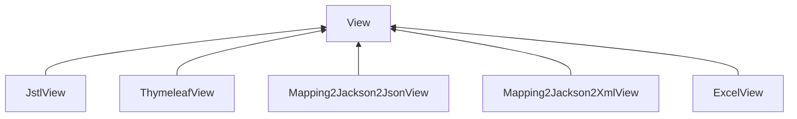
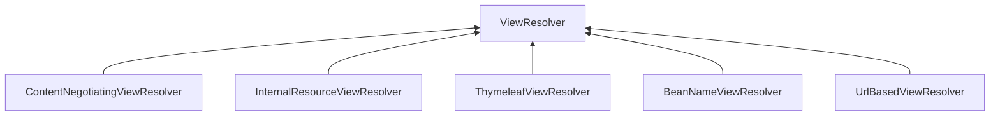
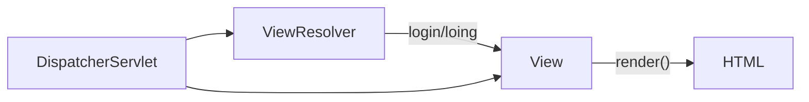
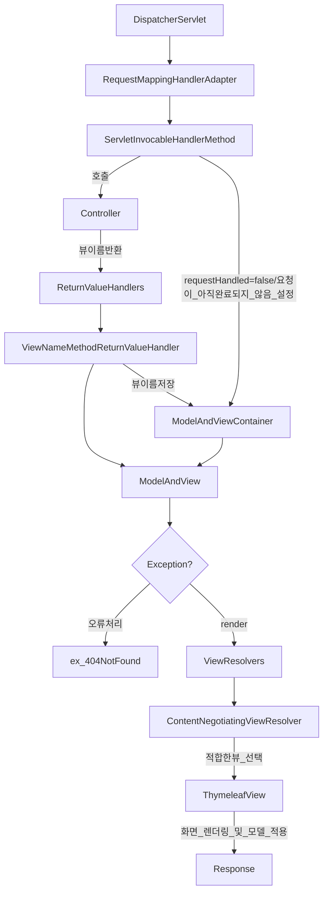

# View, ViewResolver
## View, ViewResolver
### View
* 스프링 MVC에서 View는 웹 페이지를 사용자에게 보여주는 역할을 한다.
* View는 컨트롤러가 처리한 데이터를 사용자에게 보여주는 화면이며 사용자가 볼 수 있는 HTML, JSON 같은 결과물을 만들어주는 역할을 한다.

### 계층도

### ViewResolver
* 스프링의 View 시스템은 ViewResolver와 View 인터페이스를 기반으로 동작하며 ViewResolver는 특정 URL 요청에 따라 어떤 View를 사용할지를 결정하는 역할을 하고 View는 최종적으로 데이터를 렌더링하여 클라이언트에 반환한다.

### 계층도

### ViewResolver 구현체
* 스프링 MVC는 초기화 시점에 자동으로 기본 ViewResolver 구현체를 생성하고 등록한다.
* ContentNegotiatingViewResolver, InternalResourceViewResolver, ViewResolverComposite, 그리고 타임리프 의존성이 추가 되면 ThymeleafViewResolver 까지 포함한다.
* ContentNegotiatingViewResolver가 가장 우선 순위가 높으며 이 클래스 안에 ThymeleafViewResolver, InternalResourceViewResolver, ViewResolverComposite 가 목록으로 저장되어 있으며 ThymeleafViewResolver가 우선순위가 가장 높다.

### ViewResolver 의 View 결정 기준
* ContentNegotiatingViewResolver은 각 ViewResolver에 의해 생성된 View 객체들을 순회하며 가장 적합한 View를 결정해서 반환한다.

1. 클라이언트의 요청 헤더에 포함된 MediaType(Accept 헤더) 목록과 View의 Content-Type을 비교해서 서로 호환이 되는 MediaType이 존재하는지 확인한다.
2. MediaType이 호환되는 첫 번째 View가 최종 선택되어 반환되고 적합한 View가 없으면 다음 View로 넘어간다. 만약 View가 없으면 예외가 발생한다.
3. 만약 ThymeleafView와 InternalResourceView 모두 선택 대상인데 ThymeleafView가 먼저 선택되면 InternalResourceView는 호환 여부를 검사 하지 않는다.

### View & ViewResolver 처리 구조

### View / ViewResolver 흐름도

## Thymeleaf
### 개요
* 스프링에서 ViewTemplate은 웹 애플리케이션의 뷰를 구성하고 렌더링하기 위한 템플릿 엔진을 가리킨다.
* ViewTemplate을 통해 서버에서 처리된 데이터를 HTML이나 다른 형식으로 출력할 수 있으며모델 데이터를 뷰로 전달하여 클라이언트에 보여주는 역할을 한다.
* 스프링에서 사용되는 ViewTemplate 엔진으로는 Thymeleaf와 JSP가 있으며 요즘은 대부분 Thymeleaf 엔진을 사용하고 있다. 

### Thymeleaf 특징
1. 자연 템플릿 (Natural Templates)
   * Thymeleaf는 HTML 파일이 브라우저에서 열렸을 때도 정상적인 HTML 페이지로 보일 수 있도록 설계된 "자연 템플릿" 기능을 제공한다.
   * 즉, Thymeleaf 템플릿은 서버 측 렌더링 없이도 개발자가 미리보기 할 수 있다. (JSP은 서블릿의 일종이기 때문에 서블릿컨네이터 안에서 렌더링이 필요하다.)
2. HTML 친화적인 문법
   * Thymeleaf는 HTML5와 잘 호환되도록 설계되어 HTML 문서 작성과 비슷하게 템플릿을 구성할 수 있고 스프링 부트와 완벽하게 통합되어 쉽게 설정하고 사용할 수 있다.
3. 더 강력한 표현식 지원
   * Thymeleaf는 다양한 표현식을 지원하며복잡한 데이터 처리를 위한 기능을 내장하고 있다. 예를 들어, 조건문(th:if, th:unless), 반복문(th:each), URL 처리, 메시지 처리 등을 다양한 속성으로 지원한다.

### Thymeleaf 사용법
1. 의존성 추가
   * `implementation 'org.springframework.boot:spring-boot-starter-thymeleaf'`
2. 기본 디렉토리 구조
   * 기본적으로 src/main/resources/templates 폴더가 루트 위치가 된다.
   * templates 폴더 아래에 원하는 폴더 및 .html 파일을 생성한다.
3. HTML 사용 선언
   * `<html xmlns:th="http://www.thymeleaf.org">`
