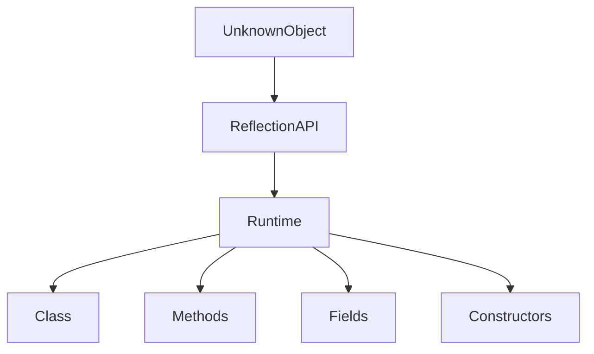
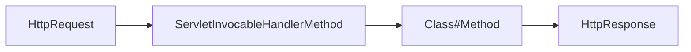
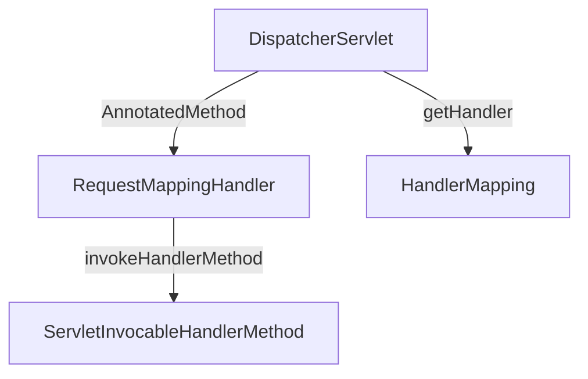

# 스프링 웹 MVC 핸들러 메서드 실행 구조 이해
## 자바 리플렉션 이해
### 개요
* 리플렉션(Reflection)은 어플리케이션의 실행 시점에 클래스, 메서드, 필드 등을 분석하고 조작할 수 있는 기능을 제공하는 강력한 도구로서 객체의 클래스 타입 정보를 동적으로 가져오고 객체의 메서드 실행이나 필드 값을 읽고 수정하는 등의 작업을 수행할 수 있다.

### 동작방식

### 주요 클래스
* Class
  * Reflection 의 핵심 클래스로서클래스의 메타데이터를 표현한다
  * 참조 방식
    * Class.forName(String className)
      * Class<?> clazz = Class.forName("java.util.ArrayList");
    * .class 키워드
      * Class<?> clazz = String.class;
    * .getClass() 메서드
      * Class<?> clazz = str.getClass();
* Field
  * 클래스의 필드를 나타내며 필드 이름, 타입, 접근 제어자, 값을 조회 및 수정할 수 있다
  * 참조 방식
    * getDeclaredFields()
      * private 접근 제어자를 가진 필드포함
      * Field[] fields = clazz.getDeclaredFields();
    * getDeclaredField(String fieldName)
      * Field field = clazz.getDeclaredField("name");
    * getFields()
      * public 접근 제어자를 가진 필드만참조가능
      * Field[] publicFields = clazz.getFields();
* Method
  * 클래스의 메서드를 나타내며 메서드 이름, 반환 타입, 매개변수 타입, 접근 제어자 정보를 조회할 수 있으며런타임에 메서드를 실행할 수 있다
  * 참조 방식
    * getDeclaredMethods 
      * private 접근 제어자를 가진 필드포함
      * Method[] methods = clazz.getDeclaredMethods();
        * getDeclaredMethod(String methodName, Class<?>... parameterTypes)
          * Method method = clazz.getDeclaredMethod("add", int.class, Object.class);
      * getMethods()
        * public 접근 제어자를 가진 필드만참조가능
        * Method[] publicMethods = clazz.getMethods(); (public 접근 제어자를 가진 필드만)
* Constructor 
  * 클래스의 생성자를 나타내며 생성자 정보 조회 및 객체 생성에 사용된다
  * 참조 방식
    * getDeclaredConstructors() - private 접근 제어자를 가진 필드포함
      * Constructor<?>[] constructors = clazz.getDeclaredConstructors();
    * getDeclaredConstructor(Class<?>... parameterTypes)
      * Constructor<?> constructor = clazz.getDeclaredConstructor(String.class);
    * getConstructors() - public 접근 제어자를 가진 필드만참조가능
      * Constructor<?>[] publicConstructors = clazz.getConstructors();; (public 접근 제어자를 가진 필드만)

## 자바 리플렉션 예제
### 개요
* 이 예제는 Java Reflection을 사용하여 객체의 필드(Field)와 메서드(Method) 정보를 동적으로 관리하고 실행하는 기능을 제공한다.
* 핵심 클래스로 ReflectionFieldManager, ReflectionMethodManager, ReflectionExecutor를 사용한다.

### ReflectionFieldManager - 필드 관련 작업을 관리
```java
class ReflectionFieldManager {
    private final Map<String, Field> fieldMap = new HashMap<>();

    public ReflectionFieldManager(Class<?> clazz) {
        for (Field field : clazz.getDeclaredFields()) {
            field.setAccessible(true);
            fieldMap.put(field.getName(), field);
        }
    }

    public Field getField(String fieldName) {
        return fieldMap.get(fieldName);
    }

    public void setFieldValue(Object target, String fieldName, Object value) throws IllegalAccessException {
        Field field = getField(fieldName);
        if (field != null) field.set(target, value);
    }

    public Object getFieldValue(Object target, String fieldName) throws IllegalAccessException {
        Field field = getField(fieldName);
        if (field != null) return field.get(target);
        return null;
    }
}
```
## 자바 핸들러 메서드 호출 원리
### 개요
* 스프링의 핸들러 메서드를 호출하기 위해 내부적으로 사용되는 클래스로서 InvocableHandlerMethod와 이를 확장한 ServletInvocableHandlerMethod 클래스가 있다.
* 메서드 호출 시 메서드 파라미터를 해석하기 위한 HandlerMethodArgumentResolver와 메서드 반환 값을 처리하기 위한 HandlerMethodReturnValueHandler와 같은 클래스와 연계하여 요청을 처리하고 있다.
* InvocableHandlerMethod는 범용적 메서드 호출 클래스이며 ServletInvocableHandlerMethod HTTP 요청/응답 처리 클래스로 구분할 수 있다.




### InvocableHandlerMethod
* HTTP 프로토콜에 독립적이며 범용적인 메서드 호출 기능을 제공하고 매개변수 처리를 위해 HandlerMethodArgumentResolver를 사용한다.
* 메서드를 호출한 결과를 반환하지만 내부적으로 반환값을 추가로 처리하지는 않는다.

### ServletInvocableHandlerMethod
* InvocableHandlerMethod를 상속한 클래스로서 Servlet 환경에 특화되어 있으며(HttpServletRequest/HttpServletResponse) HTTP 요청 및 응답을 포함한 핸들러 메서드를 호출 한다.
* 메서드의 반환값을 HandlerMethodReturnValueHandler를 통해 처리할 수 있으며 메서드 레벨의 @ResponseStatus 애노테이션을 지원하여 HTTP 응답 상태를 설정할 수 있다.

## 메서드 파라미터 실행 구조 이해
* RequestMappingHandlerAdapter 클래스와 연관 클래스들의 실행 구조를 분석함으로서 스프링 MVC의 내부 흐름을 더 깊이 이해하고 개발적 관점에서의 인사이트를 넓혀 갈수 있다.

### 핵심 클래스
* ServletInvocableHandlerMethod
  * HTTP 요청 데이터를 받아 메서드를 실행시키는 클래스로서 HandlerMethodArgumentResolver를 통해 요청 데이터를 메서드의 매개변수에 맞게 변환하고이를 사용해 메서드를 호출한다.
* AnnotatedMethod
  * 호출 메서드 및 메서드 파라미터 정보를 가지고 있으며 파라미터에 애노테이션 정보를 탐색할 수 있다.
* MethodParameter
  * 메서드에 있는 파라미터의 정보를 관리하는 클래스로서 메서드의 애노테이션을 분석하고 파라미터가 어디에 있고 어떤 타입인지를 편리하게 알 수 있게 해주는 도구이다.
* MethodIntrospector
  * 메서드를 탐색할 수 있게 해주는 클래스로서 특정 애노테이션이 적용된 메서드들의 리스트를 구하거나 메서드의 메타데이터를 찾도록 돕는 도구이다.

#### MethodIntrospector
* 스프링 부트가 구동이 되면 초기화 시점에 빈 클래스들을 스캔하면서 @RequestMapping이 선언된 Method 객체들을 생성한다.

#### AnnotatedMethod & MethodParameter
* 스캔한 메서드들의 파라미터 메타 정보들을 가지는 MethodParameter 객체를 생성한다.

#### ServletInvocableHandlerMethod
* InvocableHandlerMethod 클래스를 확장한 웹처리용 클래스로서 핸들러의 메서드를 호출하는 기능을 가지고 있다.
* HTTP 요청 정보를 분석하고 해당 요청에 매핑되어 있는 AnnotatedMethod 객체를 찾아 새로운 ServletInvocableHandlerMethod를 생성하고 전달한다.
* AnnotatedMethod에 저장되어 있는 Method, MethodParameter 정보들을 ServletInvocableHandlerMethod에 복사한다.



## 메서드 파라미터 커스텀 구현하기
### 개요
* 스프링 내부 클래스를 활용 및 확장하여 HTTP 요청에 대한 응답 과정을 커스텀하게 구현할 수 있다.

### 주요 클래스 이해
* DispatcherController
  * 클라이언트의 요청을 받아 동적으로 서비스의 메서드를 호출할 수 있도록 한다.
* MethodExtractor
  * 서비스 클래스의 커스텀 애노테이션이 적용된 메서드들의 리스트를 추출한다.
* DynamicMethodInvoker
  * InvocableHandlerMethod를 사용하여 커스텀 애노테이션이 적용된 메서드를 호출한다.
* CustomHandlerMethodArgumentResolver
  * 메서드 호출에 필요한 파라미터 값을 구한다.
* @CustomAnnotation
  * 특정 메서드에 선언하기 위한 커스텀 애노테이션
* MyService
  * 커스텀 어노테이션이 선언된 메서드를 정의하며 DynamicMethodInvoker에 의해 호출된다.
