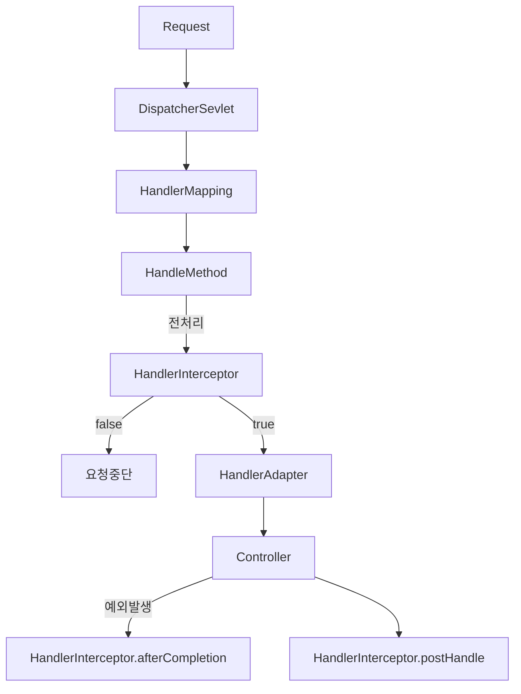

# 스프링 웹 MVC 공통 기능
## 인터셉터(Interceptor)
### 개요
* 인터셉터(Interceptor)는 핸들러의 실행 전후 또는 뷰 렌더링 이후 특정 로직을 실행할 수 있으며 HandlerInterceptor 인터페이스를 구현하여 사용할 수 있다.
* 주로 여러 컨트롤러에서 공통으로 사용하는 기능을 구현하거나 재사용성을 높이고자 할 때 사용한다. (인증, 인가, 로깅, 통계집계 등..)

### 구조
* preHandle
  * 컨트롤러 실행 전에 호출되며호출 할 Handler 객체가 인자로 전달된다.
  * Boolean 반환값으로 True를 반환하면 다음 단계로 진행하고 false를 반환하면 요청 처리를 즉시 중단한다.
* postHandle
  * 컨트롤러 실행 후뷰 렌더링 전에 호출되며 호출된 Handler 및 ModelAndView 객체가 인자로 전달된다.
* afterCompletion
  * 뷰 렌더링이 완료된 후 호출되며 호출된 Handler 및 예외 발생 시 예외타입이 인자로 전달된다.
  * afterCompletion은 예외가 발생해도 무조건 호출되므로 반드시 해야 할 공통 작업이 있다면 여기서 수행하도록 한다.

### 흐름도

### 인터셉터 사용
* HandlerInterceptor 인터페이스 또는 HandlerInterceptorAdapter 클래스를 상속하여 구현한다.
* WebMvcConfigurer 를 사용하여 인터셉터를 등록한다.
  * 특정 URL 패턴에만 인터셉터를 적용하거나 제외 할 수 있다.
  * order 속성을 통해인터셉터의 호출 순서를 지정할 수 있다.

## ControllerAdvice
