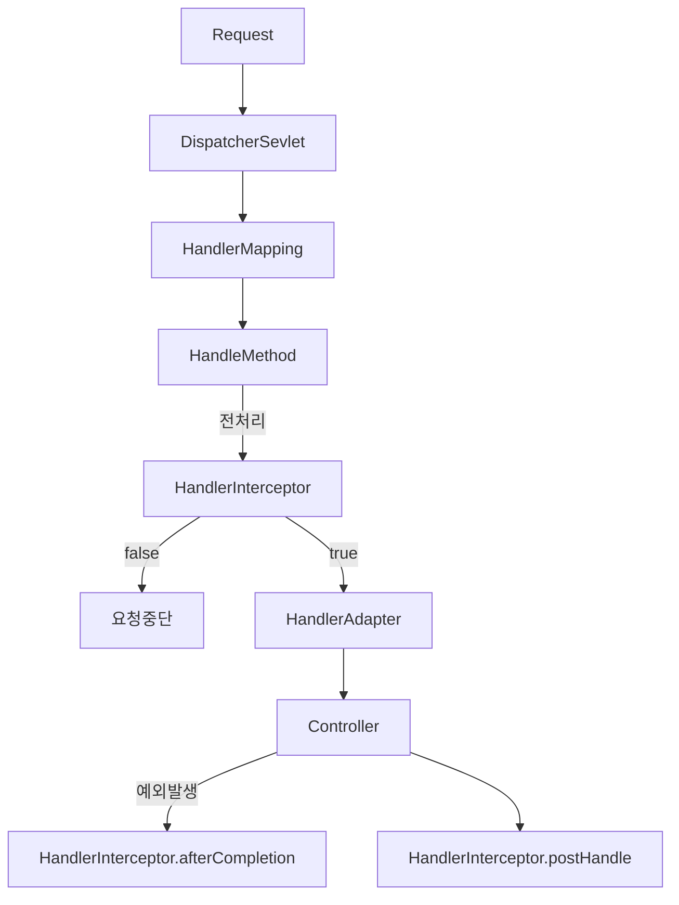

# 스프링 웹 MVC 공통 기능
## 인터셉터(Interceptor)
### 개요
* 인터셉터(Interceptor)는 핸들러의 실행 전후 또는 뷰 렌더링 이후 특정 로직을 실행할 수 있으며 HandlerInterceptor 인터페이스를 구현하여 사용할 수 있다.
* 주로 여러 컨트롤러에서 공통으로 사용하는 기능을 구현하거나 재사용성을 높이고자 할 때 사용한다. (인증, 인가, 로깅, 통계집계 등..)

### 구조
* preHandle
  * 컨트롤러 실행 전에 호출되며호출 할 Handler 객체가 인자로 전달된다.
  * Boolean 반환값으로 True를 반환하면 다음 단계로 진행하고 false를 반환하면 요청 처리를 즉시 중단한다.
* postHandle
  * 컨트롤러 실행 후뷰 렌더링 전에 호출되며 호출된 Handler 및 ModelAndView 객체가 인자로 전달된다.
* afterCompletion
  * 뷰 렌더링이 완료된 후 호출되며 호출된 Handler 및 예외 발생 시 예외타입이 인자로 전달된다.
  * afterCompletion은 예외가 발생해도 무조건 호출되므로 반드시 해야 할 공통 작업이 있다면 여기서 수행하도록 한다.

### 흐름도


### 인터셉터 사용
* HandlerInterceptor 인터페이스 또는 HandlerInterceptorAdapter 클래스를 상속하여 구현한다.
* WebMvcConfigurer 를 사용하여 인터셉터를 등록한다.
  * 특정 URL 패턴에만 인터셉터를 적용하거나 제외 할 수 있다.
  * order 속성을 통해인터셉터의 호출 순서를 지정할 수 있다.

## ControllerAdvice
### 개요
* @ControllerAdvice는 특정 컨트롤러 또는 전체 컨트롤러에서 발생하는 예외를 전역적으로 처리하거나컨트롤러와 관련된 공통적인 기능을 구현하는 데 사용된다.
* @ControllerAdvice는 클래스 레벨에 선언하며 메서드 레벨에 선언하는 애노테이션(@ExceptionHandler, @ModelAttribute, @InitBinder)과 함께 사용할 수 있다.

### 주요 용도
* @ExceptionHandler
  * 예외 처리
  * 메서드 실행 후 적용
  * 컨트롤러에서 발생한 예외를 전역으로 처리할 수 있으며 적절한 응답을 생성할 수 있다.
* @ModelAttribute
  * 모델 속성 관리
  * 메서드 실행 전에 적용
  * 컨트롤러의 모든 요청에 공통적으로 필요한 데이터를 추가할 수 있다.
* @InitBinder
  * 데이터 바인딩
  * 메서드 실행 전에 적용
  * 요청 파라미터를 특정 형식으로 변환하거나 검증 로직을 적용할 수 있다.

### 여러 @ControllerAdvice 적용 순서
```java
@RestControllerAdvice
@Order(1) // 우선순위 높음
public class RestGlobalExceptionHandler {
    @ExceptionHandler(IllegalArgumentException.class)
    public ResponseEntity<String> handleIllegalArgumentException(IllegalArgumentException ex) {
        return ResponseEntity.status(HttpStatus.BAD_REQUEST).body("[RestControllerAdvice] Error: " + ex.getMessage());
    }
}
 
@ControllerAdvice
@Order(2) // 우선순위 낮음
public class GlobalExceptionHandler {
    @ExceptionHandler(IllegalArgumentException.class)
    public ResponseEntity<String> handleIllegalArgumentException(IllegalArgumentException ex) {
        return ResponseEntity.status(HttpStatus.BAD_REQUEST).body("[ControllerAdvice] Error: " + ex.getMessage());
    }
}
```
* 다중 @ControllerAdvice가 있을 경우 @Order 숫자가 낮을수록 높은 우선순위를 가진다.
* 여러 개의 ControllerAdvice에서 동일한 예외 타입이 선언되어 있을 경우 어떤 @ControllerAdvice가 우선순위가 높은지 명확한 순서를 보장하지 않기 때문에 @Order를 사용해 순서를 지정해 사용하도록 한다.
* 컨트롤러 내부에 @ExceptionHandler가 있으면 @ControllerAdvice 보다 우선 적용됨

