# 예외 처리
## 서블릿 예외 처리
### 개요
* 클라이언트 요청 처리 중 발생한 예외는 컨트롤러, 필터, 서블릿, DispatcherServlet등에서 처리되지 않을 경우 상위 계층으로 전파되어 최종 WAS까지 전달 된다.
* 서블릿은 크게 두 가지 유형으로 오류처리를 지원하는데 하나는 실제 예외가 발생하는 경우, 또 하나는 Response.sendError()를 통해 오류 상태를 기록하는 경우이다.

### 예외 발생
* 컨트롤러에서 발생한 예외나 오류는 응답상태코드에 따라 서버내부오류, 페이지 찾을 수 없음 등으로 나타나며 WAS에서 최종 오류 처리를 제어한다.

### Response.sendError()
* Response.sendError()는 요청이 잘못되었거나 서버에서 처리할 수 없는 상황이 발생했을 때 클라이언트에게 HTTP 상태 코드와 오류 메시지를 전송하기 위해 사용된다.

### API
* sendError(int sc)- HTTP 상태 코드만 전송
* sendError(int sc, String msg)- HTTP 상태 코드와 함께 사용자 정의 오류 메시지 전송

### 동작방식
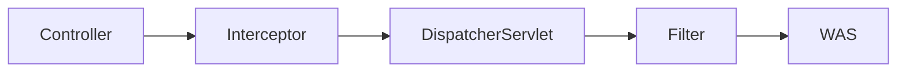

## WAS 표준 오류 정책 - ErrorPage
* ErrorPage는 WAS 에서 발생하는 예외나 특정 HTTP 상태 코드에 대해 오류 페이지를 설정하고 렌더링하는 기능을 제공하는 클래스이다.
* ErrorPage는 클라이언트에게 서버의 오류 상황을 명확히 전달하고사용자 친화적인 메시지를 제공하기 위한 표준적인 방법이다.

### 초기화 작업
* 애플리케이션이 초기화 되면 스프링의 ErrorPage와 WAS의 ErrorPage를 각각 생성하고 기본값들로 채우게 되며 WAS에는 기본 오류 페이지 한 개가 생성된다.
* ErrorPage는 설정을 통해 여러 개 추가 할 수 있으며 application.properties 파일에 server.error.xxx 로 ErrorPage의 기본 속성 값들을 변경할 수 있다.

### ErrorPage 추가
* web.xml
```xml
<web-app>
    <!-- 404 상태 코드에 대한 오류 페이지 -->
    <error-page>
        <error-code>404</error-code>
        <location>/errors/404.html</location>
    </error-page>
    <!-- 특정 예외 유형에 대한 오류 페이지 -->
    <error-page>
        <exception-type>java.lang.RuntimeException</exception-type>
        <location>/errors/error.html</location>
    </error-page>
 </web-app>
```
* Java
```java
@Component
public class CustomTomcatWebServerCustomizer implements WebServerFactoryCustomizer<TomcatServletWebServerFactory> {
    @Override
    public void customize(TomcatServletWebServerFactory factory) {
        // 401 에러에 대한 사용자 정의 페이지 설정
        factory.addErrorPages(new ErrorPage(HttpStatus.UNAUTHORIZED, "/error/401"));
        // 404 에러에 대한 사용자 정의 페이지 설정
        factory.addErrorPages(new ErrorPage(HttpStatus.NOT_FOUND, "/error/404"));
        // 500 에러에 대한 사용자 정의 페이지 설정
        factory.addErrorPages(new ErrorPage(HttpStatus.INTERNAL_SERVER_ERROR, "/error/500"));
        // Exception 발생 시 사용자 정의 페이지 설정
        factory.addErrorPages(new ErrorPage(ServletException.class, "/error/exception"));
    }
 }
```

### 오류 정보 전달 메커니즘
* WAS는 오류가 발생했을 때오류 페이지를 다시 요청하는 것 외에 오류에 대한 상세 정보를 HttpServletRequest의 속성에 추가하여 전달한다.
* HttpServletRequest 속성에 저장된 요청의 상태 코드, 발생한 예외, 오류 메시지 등을 동적으로 보여 주거나 활용할 수 있다.

## 스프링의 기본 오류처리 BasicErrorController
### 개요
* BasicErrorController는 Spring Boot에서 제공하는 기본적인 오류 처리 컨트롤러로 애플리케이션에서 발생하는 예외 또는 오류를 처리하고 기본적인 오류 페이지 및 JSON 형식의 오류 응답을 반환한다.
* BasicErrorController는 기본적으로 /error 경로로 요청하는 모든 오류를 처리하고 있으며 이는 WAS에서 오류 페이지를 요청하는 기본 경로인 /error와 일치한다.

### 구조 및 특징
* 오류 처리의 기본 동작 제공
  * 클라이언트로부터 발생하는 HTTP 상태 코드를 기반으로 HTML 오류 페이지(Whitelabel Error Page) 혹은 REST API의 경우 JSON 형식으로 응답한다.
* 사용자 정의 오류 처리
  * 개발자는 ErrorController를 구현하여 기본 동작을 커스터마이징할 수 있다.
* ErrorAttributes와 연동
  * 오류 관련 데이터를 제공하는 ErrorAttributes와 연계하여 오류의 세부 정보를 응답에 포함할 수 있다.

### 오류 처리 방식
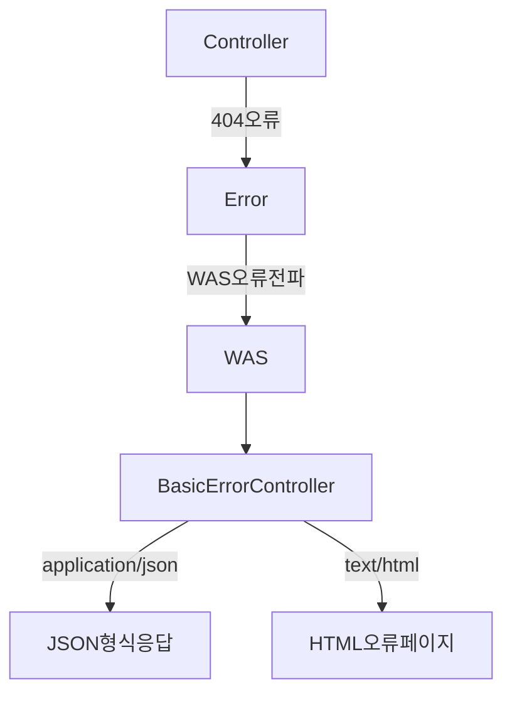

### View 방식의 오류 처리 -ErrorViewResolve
* ErrorViewResolver는 오류가 발생했을 때 보여줄 화면(오류 페이지)을 찾는 역할을 한다.
* 기본적으로 /error/ 경로 아래에서 오류 코드(예: 404, 500)나 오류의 종류에 맞는 템플릿 파일이나 정적 리소스를 찾아서 적절한 화면을 보여주는 역할을 한다.

#### 흐름도
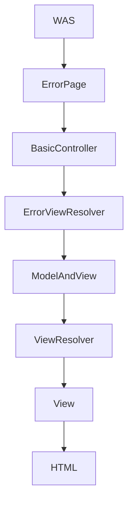

#### 오류 화면 우선 순위
1) 뷰 템플릿
   * resources/templates/error/400.html
   * resources/templates/error/4xx.html
2) 정적 리소스
   * resources/static/error/500.html
   * resources/static/error/5xx.html
3) 적용 대상이 없을 때( error )
   * resources/templates/error.html

### Rest API 방식의오류 처리
* Spring Boot는 REST 요청(Accept: application/json)이 발생했을 때 BasicErrorController를 사용해 JSON 형식의 오류 응답을 자동으로 생성해 준다.

#### 흐름도
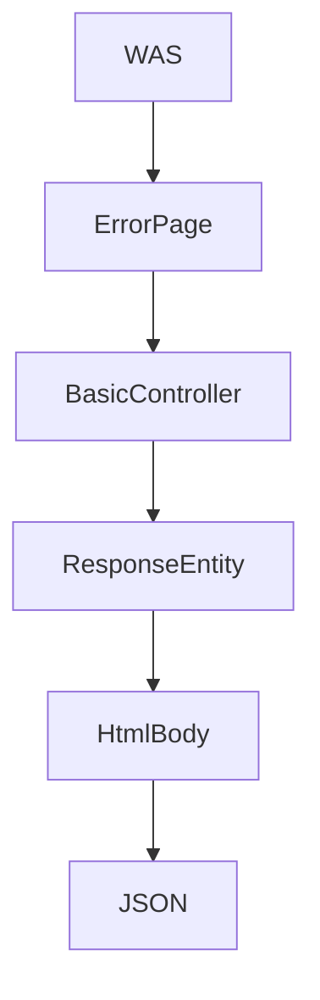

### 오류 정보 처리 - ErrorAttributes
* 오류가 발생했을 때 오류와 관련된 정보를 가져올 수 있게 해주는 기능으로 Model에 담아서 이 정보를 로그로 기록하거나 사용자에게 보여줄 때 사용할 수 있다.

### 흐름도
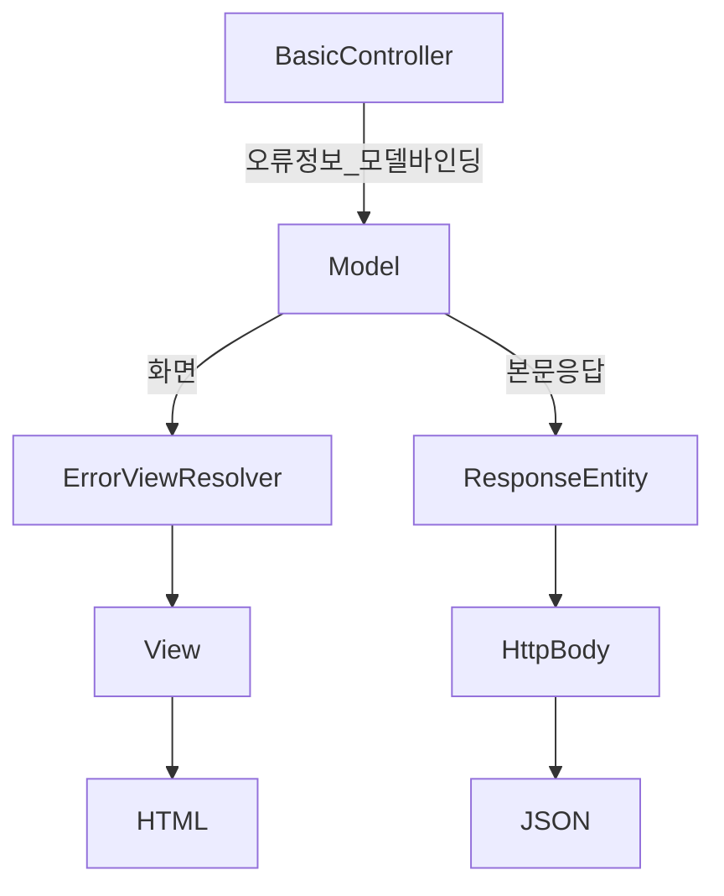

## 스프링의 통합 예외 전략 개요
### 개요
* 오류 발생 시 WAS는 오류 정보를 담은 ErrorPage를 사용해서 /error로 요청을 포워딩 하고 BasicErrorController가 그 요청을 받아 적절한오류 처리를 한다.
* text/html 방식의 요청이 들어오면 사용자 정의 오류 페이지(HTML)를 반환 하고 REST API 방식의 요청이 들어오면 JSON 형태로 오류 정보를 반환 한다.
* 템플릿이나 정적 리소스에 오류 페이지를 구성해 놓으면 오류 상태 코드나 예외에 따라 자동으로 적절한 오류 화면을 반환하거나 데이터를 반환한다.

### ErrorPage & BasicErrorController 한계점
* WAS의 ErrorPage는 주로 정적인 HTML 페이지 또는 JSP로 연결되며동적인 데이터나 사용자 정의 응답을 제공하기 어렵다.
* BasicErrorController는 예외를 전역적으로 처리하지만 특정 컨트롤러나 요청 경로에 따른 세분화된 처리 로직을 구현하기 어렵다.
* REST API에서 특정 예외(예: 인증 오류, 회원 오류, 주문 오류)에 대해 메시지와 상태 코드를 반환 하려면 개별적인 오류 형태 구현이 필요하다.

### ErrorPage & BasicErrorController 오류 처리 과정
1. 클라이언트 요청 -> WAS 요청 전달
2. WAS -> DispatcherServlet 요청 전달
3. DispatcherServlet --> 컨트롤 매핑
4. 컨트롤러에서 예외 발생
5. WAS까지 예외가 전파되어 예외를 처리 -> /error로 포워딩
6. BasicErrorController에서 /error 요청을 받고 JSON 또는 HTML 오류 화면 생성하고 클라이언트로 응답.

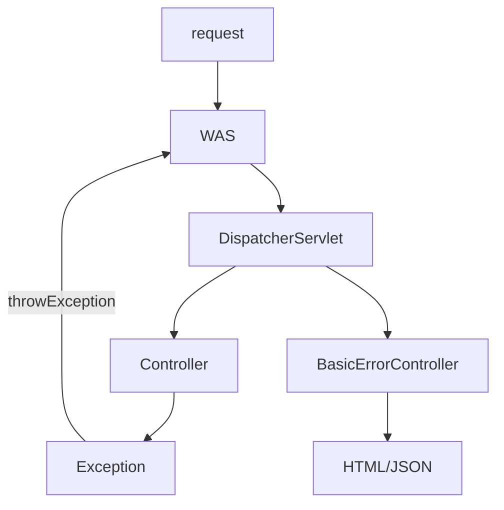

### 개선 된 오류 처리 과정
1. 클라이언트 요청 → WAS 로 요청 전달
2. WAS → DispatcherServlet 요청 전달
3. DispatcherServlet → 컨트롤러 매핑
4. 컨트롤러에서 예외 발생
5. 스프링MVC의 흐름 안에서 예외 해결

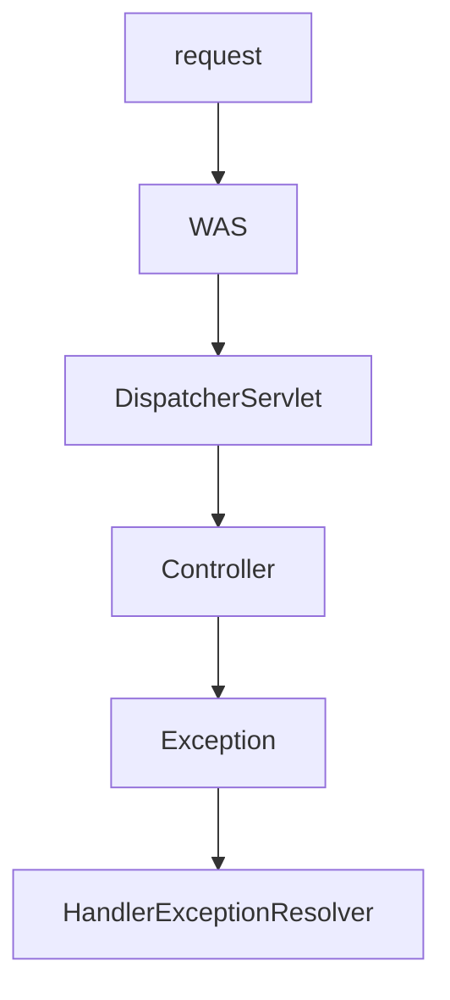

### 더 강력한 스프링 예외 전략 제공
* 특정 예외마다 다른 처리 로직을 구현할 수 있으며 예외 유형별로 HTTP 상태 코드, 응답 메시지, 추가 데이터 등을 원하는 대로 설정할 수 있다.
* WAS의 오류 처리 메커니즘에 의존하지 않고 애플리케이션 코드 내에서 예외를 처리하고 응답을 반환할 수 있다.
* 스프링 MVC에서 발생한 예외는 HandlerExceptionResolver 클래스가 해결하도록 한다.

## HandlerExceptionResolver
### 개요
* HandlerExceptionResolver 인터페이스는 요청 처리 중에 발생한 예외를 처리하고 그 결과를 사용자에게 보여줄 수 있는 에러 페이지로 연결해 주는 역할을 한다.
* 즉 컨트롤러나 핸들러 실행 중에 문제가 생기면 이 문제를 어떻게 해결하고 어떤 에러 화면을 보여줄지를 정해주는 역할을 한다.

### 구현체
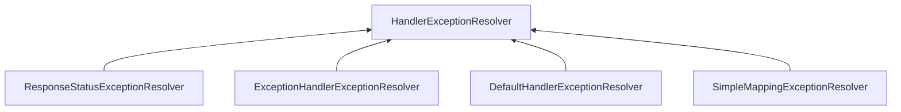
### HandlerExceptionResolver의 예외 전략
* HandlerExceptionResolver는 RequestMappingHandleAdapter가 핸들러 실행 후 ModelAndView 객체를 반환하는 것과 동일한 구조를 가지고 있다.
* 즉 예외 상황에서도 기존의 MVC 처리 흐름을 벗어나지 않고 정상적인 흐름 안에서 예외 처리를 구현할 수 있다.

### 기본구현
```java
public class CustomHandlerExceptionResolver implements HandlerExceptionResolver {
    @Override
    public ModelAndView resolveException(HttpServletRequest req, HttpServletResponse resp, Object handler, Exception ex) {
        if (ex instanceof CustomException) {
            return new ModelAndView(viewName, model);// 오류 화면으로 응답
        } else if (ex instanceof RuntimeException) {
            response.sendError(HttpServletResponse.SC_BAD_REQUEST, ex.getMessage()); // WAS 로 오류 전파
            return new ModelAndView();// 오류 화면 생성하지 않음
        }
        return null;
    }
}
```
1) new ModelAndView() - 화면을 렌더링 하지 않고 JSON 형태로 예외를 응답하거나sendError(errCode)로 예외 처리를 WAS 로 넘기고자 할 경우이다.
2) new ModelAndView(viewName,model) - 지정한 경로로 화면을 렌더링 한다.
3) null - 예외를 그대로 WAS로 전달하고 기본 ErrorPage의 /error로 오류 처리가 이루어진다.

### WebMvcConfigurer 등록
```java
@Override
public void extendHandlerExceptionResolvers(List<HandlerExceptionResolver>resolvers) {
    resolvers.add(new CustomHandlerExceptionResolver());
}
```
### HandlerExceptionResolver 예외 처리 흐름도
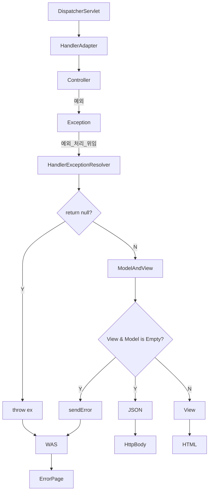

## HandlerExceptionResolver 기본 구현체들
### 개요
* Spring은 기본적으로 예외 처리에 사용할 수 있는 HandlerExceptionResolver 구현ㄴ체를 제공하며 각 구현체는 특정 시나리오에 따라 예외를 처리하도록 설계되어 있다.
* 구현체는 ExceptionHandlerExceptionResolver, ResponseStatusExceptionResolver, DefaultHandlerExceptionResolver, SimpleMappingExceptionResolver로서 총 4개의 클래스가 제공된다.

### 초기화 구성
* 예외 처리시 HandlerExceptionResolverComposite가 가장 우선순위가 높으며 다음으로 resolvers에 들어 있는 순서대로 호출 된다.
* CustomHandlerExceptionResolver를 직접 구현하게 되면 기본 구현체들 다음으로 순서가 정해진다.
* 실무에서 가장 많이 사용하는 구현체는 ExceptionHandlerExceptionResolver이며 @ExceptionHandler 애노테이션과 함께 사용한다.

### ResponseStatusExceptionResolver
* ResponseStatusExceptionResolver는 예외에 대해 HTTP 상태 코드와 메시지를 매핑하여 클라이언트에게 반환할 수 있도록 설계된 예외 처리 전략이다.
* 이 구현체는 두 가지 방식으로 예외 및 HTTP 상태 코드를 처리하는데 @ResponseStatus와 ResponseStatusException를 사용하여 구현한다.
* 이 클래스는 예외를 sendError(code, msg)로 처리하기 때문에 뷰 렌더링 없이 WAS의 ErrorPage 전략에 의해 예외 처리가 이루어지도록 한다.

### @ResponseStatus
* @ResponseStatus는 code와 reason 속성으로 이루어져 있으며 resaon은 값을 직접 설정하거나 MessageSource 기능을 사용해 얻을 수 있다.

```java
@ResponseStatus(code = HttpStatus.NOT_FOUND, reason = "Resource Not Found")
@ResponseStatus(code = HttpStatus.NOT_FOUND, reason = "error.resource")
public class ResourceNotFoundException extends RuntimeException { ... }
```

### ResponseStatusException
* @ResponseStatus는 정적으로 예외와 상태 코드를 매핑하기 때문에 런타임에 다른 값을 설정할 수 없다.
* ResponseStatusException는 동적으로 상태 코드와 메시지를 설정할 수 있어 다양한 상황에서 재사용 가능하다.

### DefaultHandlerExceptionResolver
* DefaultHandlerExceptionResolver는 Spring의 표준 예외와 HTTP 상태 코드를 자동으로 매핑하여 처리하는 클래스다.
* 주로 Spring MVC 내부에서 발생하는 예외들을 처리하며특정 예외를 HTTP 상태 코드에 매핑시켜 클라이언트로 반환하는 역할을 한다.
* 이 클래스는 예외를 sendError(code, msg)로 처리하기 때문에 뷰 렌더링 없이 WAS의 ErrorPage 전략에 의해 예외 처리가 이루어지도록 한다.

### SimpleMappingExceptionResolver
* SimpleMappingExceptionResolver는 특정 예외와 View 이름을 매핑하여 예외 발생 시 지정된 뷰(View)로 전환해주는 클래스로서 애플리케이션 전역적으로 작동하며 모든 컨트롤러에 동일한 예외 처리 로직을 적용할 수 있다.
* REST API 보다는 주로 HTML 기반의 전통적인 웹 애플리케이션에서 사용하기 적합하다.
```java
@Override
public void extendHandlerExceptionResolvers(List<HandlerExceptionResolver>resolvers) {
    resolvers.add(simpleMappingExceptionResolver());   
}

public SimpleMappingExceptionResolver simpleMappingExceptionResolver() {
    SimpleMappingExceptionResolver resolver = new SimpleMappingExceptionResolver();
    
    Properties exceptionMappings = new Properties();// 예외와 뷰 매핑
    exceptionMappings.put("java.lang.ArithmeticException", "errorArithmetic");// 예외는 전체 이름을 적는다
    exceptionMappings.put("java.lang.NullPointerException", "errorNullPointer");
    
    resolver.setExceptionMappings(exceptionMappings);
    resolver.setDefaultErrorView("error-default");// 기본 오류 뷰, 발생한 예외에 맞는 뷰가 없을 경우
   
    Properties statusCodes = new Properties(); // 뷰 이름과 HTTP 상태 코드 매핑
    statusCodes.put("errorArithmetic ", "400");
    statusCodes.put("errorNullPointer ", "500");
    resolver.setStatusCodes(statusCodes);
    return resolver;
}
```

## ExceptionHandlerExceptionResolver & @ExceptionHandler
### 개요
* ExceptionHandlerExceptionResolver는 Spring MVC의 예외 처리 메커니즘 중 가장 널리 사용되는 구현체로 컨트롤러 내부 또는 전역에서 @ExceptionHandler로 정의된 메서드를 호출하여 예외를 처리한다.
* REST API에서는 요청 데이터나 비즈니스 로직에 따라 오류 정보를 세밀하게 제어해야 할 경우가 많은데 이런 동적이고 유연한 예외 처리가 가능하다.
* 특정 컨트롤러와 밀접하게 연결된 예외 처리 뿐 아니라 @ControllerAdvice를 사용하면 모든 컨트롤러에서 공통적인 예외 처리 로직을 적용할 수 있다.

### @ExceptionHandler
* @ExceptionHandler는 컨트롤러에 특정 예외를 처리하기 위한 메서드를 정의할 때 사용하는 애노테이션으로서 ExceptionHandlerExceptionResolver를 통해 실행되며 컨트롤러 클래스에서만 작동하거나 @ControllerAdvice와 함께 사용하여 애플리케이션 전역적으로 동작하도록 설정할 수도 있다.

### 기본구현
```java
@RestController
public class UserController {
    @GetMapping("/users/{id}")
    public String getUser(@PathVariable String id) { 
        throw new UserNotFoundException("User with ID " + id + " not found");
    }
    
    @ExceptionHandler(UserNotFoundException.class)// 현재 컨트롤러에서 처리하고자 하는 예외를 메서드에 정의 한다
    public ResponseEntity<String> handleUserNotFound(UserNotFoundException ex) {
        return new ResponseEntity<>(ex.getMessage(), HttpStatus.BAD_REQUEST);
    }
}
```

### 우선 순위에 따른 예외 처리
* 예외가 발생했을 때 자식 클래스 예외 처리 메서드는 항상 상위 클래스 예외 처리 메서드보다 우선적으로 호출된다.
* 즉 구체적인 예외 클래스가 선언된 @ExceptionHandler가 우선적으로 호출되며 덜 구체적인예외 처리 메서드는 그 다음 순위로 처리된다.

### 여러 개의 예외를 지정
* 하나의 @ExceptionHandler에서 여러 예외를 동시에 처리할 수 있다.
```java
@GetMapping("/name}")
public String handlePriority(@RequestParam("name") String name) {
    if ("child1".equals(name)) {
        throw new ChildException1("ChildException1");
    } else if ("child2".equals(value)) {
        throw new ChildException2("ChildException2");
    }
        
    throw new ParentException("ParentException");
}  

@ExceptionHandler({ChildException1.class, ChildException2.class, ParentException.class})
public String handleException (Exception ex) {
    return "Exception : " + ex.getMessage();
}    
```

### 예외를 지정하지 않는 경우
```java
@GetMapping("/default")
public String handleDefault() {
    throw new IllegalStateException("Default exception occurred!");
}

@ExceptionHandler
public String handleIllegalStateException(IllegalStateException ex) {
    return "Handled default exception: " + ex.getMessage();
}
```

### ExceptionHandlerExceptionResolver 구조 이해
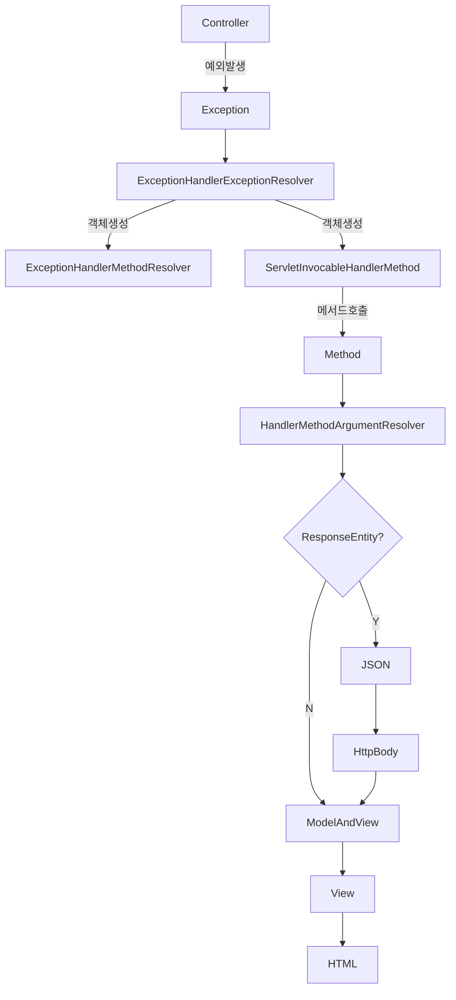

### ExceptionHandlerMethodResolver
* 주어진 클래스와 해당 클래스의 모든 상위 클래스에서 @ExceptionHandler 메서드를 찾아내어 선언된 예외와 메서드를 매핑하는 역할을 한다.
* ExceptionHandlerExceptionResolver는 ExceptionHandlerMethodResolver에서 찾아낸 메서드를 호출하는 구조로 되어 있다.

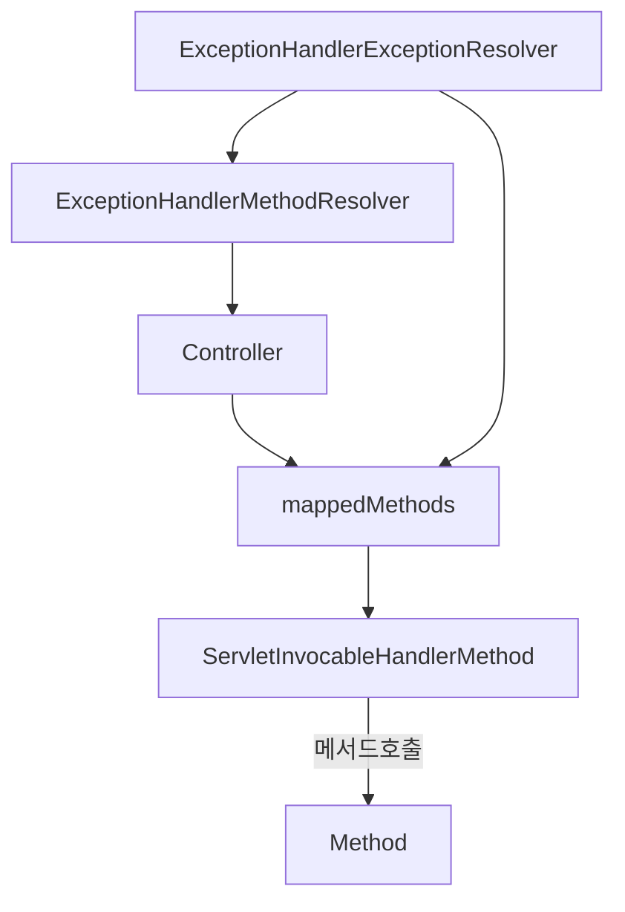

## ExceptionHandlerExceptionResolver & @ControllerAdvice
### 개요
* @ControllerAdvice는 여러 컨트롤러에서 발생하는 예외를 전역적으로 처리할 수 있는 애노테이션으로 ExceptionHandlerExceptionResolver와 결합하여 작동한다.
* @ControllerAdvice를 사용하면 애플리케이션의 모든 컨트롤러에서 발생하는 예외를 하나의 클래스에서 통합적으로 처리할 수 있으며 이를 통해 중복 코드를 제거하고예외 흐름을 컨트롤러로부터 분리할 수 있어 유지보수에도 유리하다.

### 사용방법
* 클래스에 @ControllerAdvice를 선언하고 @ExceptionHandler 메서드를 예외타입 별로 정의한다.
```java
@ControllerAdvice
public class GlobalExceptionHandler {
    @ExceptionHandler(CustomException1.class)
    public ResponseEntity<ErrorResponse> handleException1(CustomException1 ex) {
        // 예외 처리 로직
    }
    
    @ExceptionHandler(CustomException2.class)
    public ResponseEntity<ErrorResponse> handleException1(CustomException2 ex) {
        // 예외 처리 로직
    }
}
```

### 초기화 구성
* ExceptionHandlerExceptionResolver 클래스는 초기화 시 @ControllerAdvice 대상 컨트롤러를 탐색하고 ControllerAdviceBean 객체와 ExceptionHandlerMethodResolver 객체를 매핑한다. 

