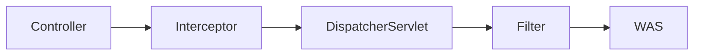

# 예외 처리
## 서블릿 예외 처리
### 개요
* 클라이언트 요청 처리 중 발생한 예외는 컨트롤러, 필터, 서블릿, DispatcherServlet등에서 처리되지 않을 경우 상위 계층으로 전파되어 최종 WAS까지 전달 된다.
* 서블릿은 크게 두 가지 유형으로 오류처리를 지원하는데 하나는 실제 예외가 발생하는 경우, 또 하나는 Response.sendError()를 통해 오류 상태를 기록하는 경우이다.

### 예외 발생
* 컨트롤러에서 발생한 예외나 오류는 응답상태코드에 따라 서버내부오류, 페이지 찾을 수 없음 등으로 나타나며 WAS에서 최종 오류 처리를 제어한다.

### Response.sendError()
* Response.sendError()는 요청이 잘못되었거나 서버에서 처리할 수 없는 상황이 발생했을 때 클라이언트에게 HTTP 상태 코드와 오류 메시지를 전송하기 위해 사용된다.

### API
* sendError(int sc)- HTTP 상태 코드만 전송
* sendError(int sc, String msg)- HTTP 상태 코드와 함께 사용자 정의 오류 메시지 전송

### 동작방식


## WAS 표준 오류 정책 - ErrorPage
* ErrorPage는 WAS 에서 발생하는 예외나 특정 HTTP 상태 코드에 대해 오류 페이지를 설정하고 렌더링하는 기능을 제공하는 클래스이다.
* ErrorPage는 클라이언트에게 서버의 오류 상황을 명확히 전달하고사용자 친화적인 메시지를 제공하기 위한 표준적인 방법이다.

### 초기화 작업
* 애플리케이션이 초기화 되면 스프링의 ErrorPage와 WAS의 ErrorPage를 각각 생성하고 기본값들로 채우게 되며 WAS에는 기본 오류 페이지 한 개가 생성된다.
* ErrorPage는 설정을 통해 여러 개 추가 할 수 있으며 application.properties 파일에 server.error.xxx 로 ErrorPage의 기본 속성 값들을 변경할 수 있다.

### ErrorPage 추가
* web.xml
```xml
<web-app>
    <!-- 404 상태 코드에 대한 오류 페이지 -->
    <error-page>
        <error-code>404</error-code>
        <location>/errors/404.html</location>
    </error-page>
    <!-- 특정 예외 유형에 대한 오류 페이지 -->
    <error-page>
        <exception-type>java.lang.RuntimeException</exception-type>
        <location>/errors/error.html</location>
    </error-page>
 </web-app>
```
* Java
```java
@Component
public class CustomTomcatWebServerCustomizer implements WebServerFactoryCustomizer<TomcatServletWebServerFactory> {
    @Override
    public void customize(TomcatServletWebServerFactory factory) {
        // 401 에러에 대한 사용자 정의 페이지 설정
        factory.addErrorPages(new ErrorPage(HttpStatus.UNAUTHORIZED, "/error/401"));
        // 404 에러에 대한 사용자 정의 페이지 설정
        factory.addErrorPages(new ErrorPage(HttpStatus.NOT_FOUND, "/error/404"));
        // 500 에러에 대한 사용자 정의 페이지 설정
        factory.addErrorPages(new ErrorPage(HttpStatus.INTERNAL_SERVER_ERROR, "/error/500"));
        // Exception 발생 시 사용자 정의 페이지 설정
        factory.addErrorPages(new ErrorPage(ServletException.class, "/error/exception"));
    }
 }
```

### 오류 정보 전달 메커니즘
* WAS는 오류가 발생했을 때오류 페이지를 다시 요청하는 것 외에 오류에 대한 상세 정보를 HttpServletRequest의 속성에 추가하여 전달한다.
* HttpServletRequest 속성에 저장된 요청의 상태 코드, 발생한 예외, 오류 메시지 등을 동적으로 보여 주거나 활용할 수 있다.


## 스프링의 기본 오류처리 BasicErrorController
## 스프링의 통합 예외 전략 개요
## HandlerExceptionResolver
## HandlerExceptionResolver 기본 구현체들
## ExceptionHandlerExceptionResolver & @ExceptionHandler
## ExceptionHandlerExceptionResolver & @ControllerAdvice
