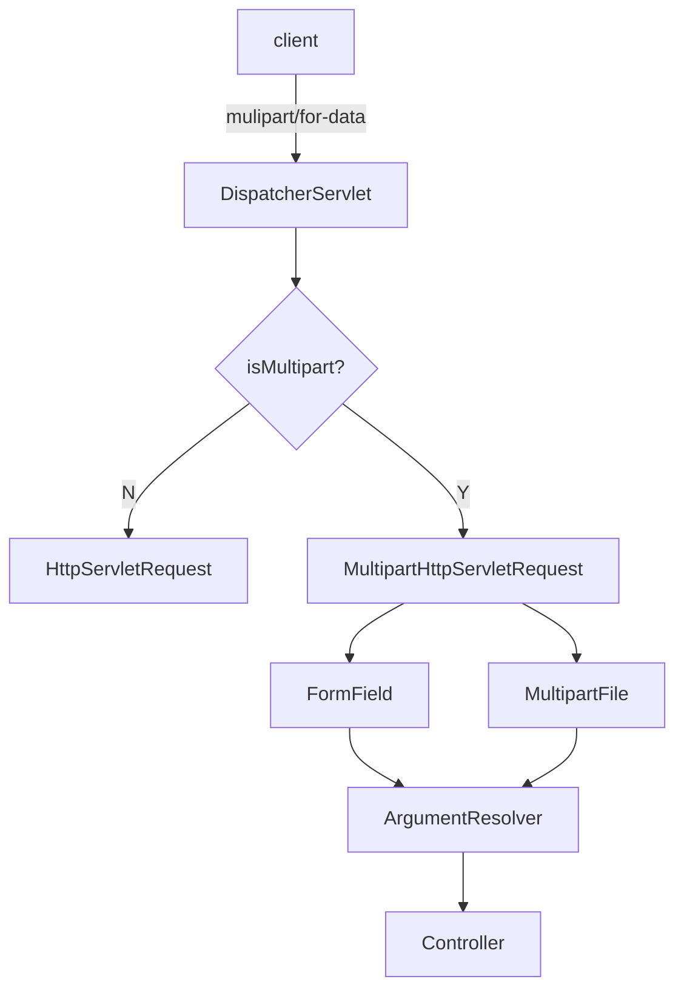

# Multipart
## 개요
* Multipart는 일반 텍스트 형식이 아니라하나의 HTTP 요청/응답 바디 내에서 여러 개의 파트를 나누어 전송하는 형식으로서 파일 업로드나 여러 데이터 파트(텍스트 파트, 바이너리 파트 등)를 함께 전송해야 할 때 주로 사용한다.
* 웹 브라우저에서 <form> 태그에 enctype="multipart/form-data"를 지정하고 파일 업로드를 수행하면 "multipart/form-data" 형식의 HTTP 요청이 전송 된다.

#### 서블릿의 HttpServletRequest로  파일 처리
```java
public class UploadServlet extends HttpServlet { 
    private static final String UPLOAD_DIR = "/path/to/upload";
 
    @Override
    protected void doPost(HttpServletRequest request, HttpServletResponse response) throws ServletException, IOException{ 
        String username = request.getParameter("username");
        Part filePart = request.getPart("file");
        String fileName = filePart.getSubmittedFileName();
        
        // 일반 폼 필드와 Part 객체를 구분하여 수동으로 처리해야 하는 불편함이 있다
        long fileSize = filePart.getSize();
        String contentType = filePart.getContentType();
        File uploadDir = new File(UPLOAD_DIR );
        String filePath = UPLOAD_DIR + File.separator + fileName;
        try (InputStream inputStream = filePart.getInputStream()) {
            Files.copy(inputStream, Paths.get(filePath));
        }
    }
}
```
#### 스프링의  MultipartFile로 파일 처리
```java
@RestController
public class FileUploadController {
    private static final String UPLOAD_DIR = "/path/to/upload";
    
    @PostMapping("/upload")
    public String handleFileUpload(@RequestParam("username") String username, @RequestParam("file") MultipartFile file) throws IOException{
        String originalFilename = file.getOriginalFilename();
        long fileSize = file.getSize();
        String contentType = file.getContentType();
 
        // 일반 폼 필드와 Part 객체를 구분할 필요가 없으며 Part 부분을 MultipartFile 이 추상화 해서 처리해 준다 
        // InputStream 을 참조할 필요가 없이  파일을 바로 복사한다. 쉽게 말해 MultipartFile 만 잘 사용하면 된다
        File uploadDir = new File(UPLOAD_DIR);
        File dest = new File(uploadDir, originalFilename);
        file.transferTo(dest);
        return "list";
    }
}
```

#### MultiPart 지원 도구
* Spring(특히 Spring Boot 3.x 기준)에서 Multipart(파일 업로드)를 처리하기 위한 도구로서 MultipartResolver, MultipartFile, MultipartHttpServletRequest 그리고 이를 사용하는 Controller/Service 구조가 유기적으로 연결되어 있다. 
* MultipartAutoConfiguration
  * SpringBoot에서 multipart/form-data 요청 처리를 자동으로 구성해주는 설정 클래스로서 추가적인 설정 없이도 @RequestParam("file") MultipartFile file을 사용하면 자동으로 멀티파트 요청을 처리하도록 구성된다.
* MultipartHttpServletRequest
  * HttpServletRequest를 상속(혹은 래핑)하여 멀티파트 폼 데이터를 처리할 수 있는 추가 메서드를 제공하는 인터페이스로서 기본 구현제로 StandardMultipartHttpServletRequest 클래스가 제공된다.
* MultipartResolver
  * multipart/form-data 요청을 해석하여 MultipartHttpServletRequest를 만들어주는 인터페이스로서 기본 구현제로 StandardServletMultipartResolver가 제공된다.
* MultipartFile
  * 업로드된 파일을 다루기 위한 인터페이스로서 getName(), getOriginalFilename(), getSize(), transferTo(File dest) 와 같은 API 가 있다
* MultipartProperties
  * Spring Boot 에서 멀티파트 설정을 위한 구성 설정 클래스이다
* @RequestPart
  * multipart 요청의 특정 파트를 직접 바인딩하기 위한 어노테이션으로서 @RequestParam 보다 좀 더 확장된 기능을 제공한다


## 파일 업로드
### MultipartFile
* 스프링에서 파일 업로드를 처리하기 위해 제공하는 인터페이스로서 HTML 폼에서 enctype="multipart/form-data"로 전송된 파일 데이터를 서버 측에서 쉽게 다룰 수 있도록 해 준다.
* 단일 파일뿐 아니라 여러 파일(List<MultipartFile> 형태 등) 업로드 또한 지원한다.

### 속성 설정
* MultipartProperties는 Multipart(파일 업로드)에 대한 주요 설정 값들을 관리하며 Spring Boot에서 파일 업로드와 관련된 동작을 손쉽게 제어할 수 있게 해 준다.
* application.properties(yml)에서 spring.servlet.multipart.* 를 중심으로 설정하며 이를 통해 파일 크기 제한, 임시 저장 경로, 요청 크기 제한 등 다양한 옵션을 간단하게 지정할 수 있다.

1. enabled
   - spring.servlet.multipart.enabled (기본값: true)
   - 파일 업로드(멀티파트)를 지원할지 여부를 설정하며 true로 설정하면 멀티파트 업로드 기능이 활성화되며, false로 설정하면 비활성화 된다.
2. maxFileSize
   - spring.servlet.multipart.max-file-size (기본값: 1MB)
   - 업로드 가능한 단일 파일의 최대 사이즈를 제한하며 10MB, 1GB 등과 같은 식으로 원하는 크기를 문자열로 설정할 수 있다.
3.  maxRequestSize
   - spring.servlet.multipart.max-request-size (기본값: 10MB)
   - 멀티파트 요청 전체의 최대 사이즈를 제한하며 여러 개의 파일을 동시에 업로드하는 경우, 전체 파일 사이즈 합이 이 값을 넘지 않도록 설정합니다.
4. location
   - spring.servlet.multipart.location
   - 파일 업로드 중 임시로 파일을 저장할 경로를 지정하며 지정하지 않으면, 서블릿 스펙에 따라 임시 폴더(예: /tmp)가 기본값으로 사용됩니다.
5. resolve-lazily (기본값: false)
   - 요청이 들어온 즉시 멀티파트 데이터를 해석하고 저장할 것인지 컨트롤러나 필터/인터셉터에서 MultipartFile이나 파라미터에 접근할 때 비로소 파일을 해석하고 저장할 것인지 설정

#### Multipart Process


## @RequestPart - JSON & 파일업로드 처리
### 개요
* @RequestPart는 multipart 요청에서 특정 part(부분)를 매핑하여 컨트롤러의 파라미터로 바인딩하는 어노테이션으로서 JSON 요청 처리 + 파일 업로드를 동시에 처리 가능하다.
* @RequestParam과 다르게 파일뿐만 아니라 JSON 객체도 받을 수 있다.

