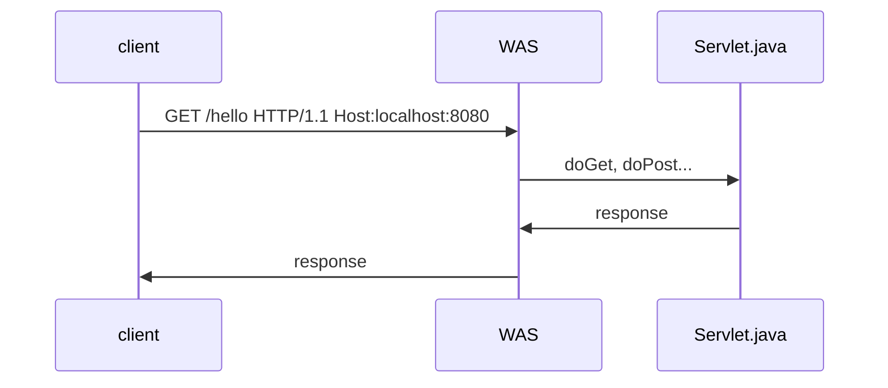
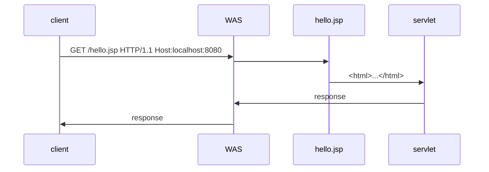
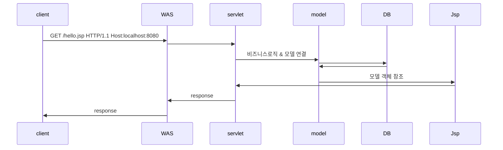

# 자바 웹 변천사
## 서블릿 방식 - Servlet
### 개요
* 서블릿은 자바 기반의 웹 애플리케이션 개발 초기 단계에서 사용된 기술로 자바로 작성된 서버 측 프로그램으로 사용되었다.
* 클라이언트의 요청을 처리하고 동적 콘텐츠를 생성하는데 사용되었는데 자바 클래스 형태로 HTTP 요청과 응답을 처리한다.

### 서블릿 컨테이너에서 실행
* 서블릿이 실행되는 환경으로, 서블릿을 관리하고 요청을 처리한다.
* Apache Tomcat, Jeus, Jboss와 같은 WAS(Web Application Server)에서 실행되는 환경이다.

### 특징
* 클래스 단위로 직접적인 HTTP 요청/응답 처리를 세밀하게 제어할 수 있따는 장점은 있다.
* HTML과 비즈니스 로직이 하나의 서블릿 클래스 안에 혼재되어 코드가 복잡해지고 유지보수가 어려워진다.
* 서블릿 방식은 코드의 재사용성을 어렵게 한다. 즉 동일한 비즈니스 로직을 여러 서블리셍서 반복해서 작성하게 되는 경우가 많다.

### 서블릿 기반 요청 프로세스

## 모델1 방식 - JSP
### 개요
* JSP(Java Server Page)를 사용하여 웹 애플리케이션의 모든 로직을 한 파일에서 처리하는 방식이다.
* 1999년 등장하여 초창기 Java 웹 애플리케이션 개발에서 많이 사용되었다.

### JSP(Java Server Page) 등장
* HTML 내에 Java 코드를 삽입하여 동적 웹 페이지를 생성하는 기술로서 서블릿의 단점을 보완하기 위해 등장한 서블릿 기반의 스크립트 언어이다.
* 모든 처리 로직이 하나의 JSP 파일에 존재한다.

### 특징
* HTML 내에 Java 코드를 직접 삽입할 수 있어 화면 로직을 작성하는데 매우 편리하고 JSTL과 같은 태그라이브러리를 사용하여 반복, 조건, 포맷 등 다양한 작업을 쉽게 처리할 수 있다.
* 그러나 여전히 화면코드와 Java 코드 모두 만들어야 하고 하나로 합치는 구조라서 서블릿에 비해 더 복잡하고 객체 지향적인 흐름을 방해한다.

### 모델1 기반 요청 프로세스

## 모델2 방식 - MVC
### 개요
* MVC(Model-View-Controller) 패턴을 따르는 구조로 서블릿과 Jsp를 결합하여 웹 애플리케이션을 개발하는 방식이다.
* 2000년대 초반부터 주류 아키텍처로 자리 잡았다.

### MVC 패턴으로 진화
* Model(Java Bean): 비즈니스 로직과 데이터 관리
* View(Jsp): 사용자 인터페이스
* Controller(Servlet): 사용자 요청을 처리하고 모델과 뷰를 연결

### 특징
* 화면은 JSP가 담당하고 비즈니스 로직은 Servlet이 담당하는 구조로 진화함으로써 코드의 분리가 명확하여 유지보수가 용이하고 확장성이 높다.
* 작은 프로젝트에 비해 구현이 복잡하며 서블릿이나 모델1에 비해 성능적으로 약간의 오버헤드가 발생할 수 있다.
* MVC 구조에 대한 확실한 이해를 바탕으로 한 전문적인 설계가 필요하며 잘못된 설계는 오히려 유지보수를 더 어렵게 할 수 있다.

### 모델2 기반 요청 프로세스

