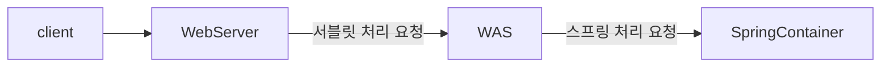
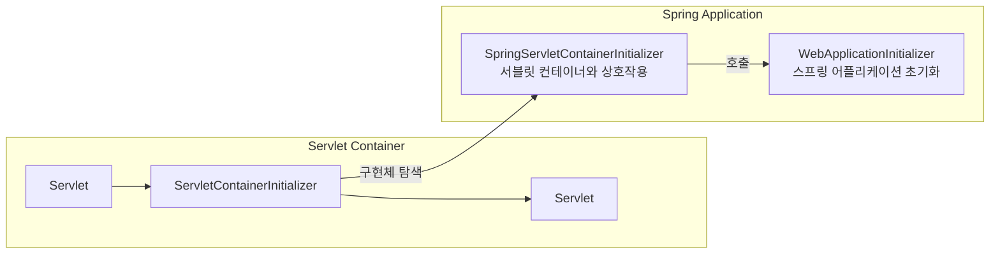
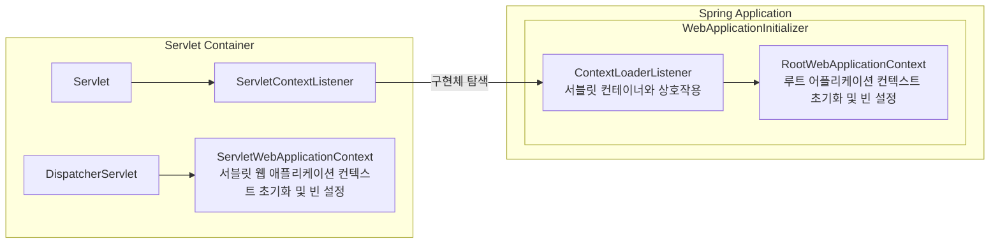
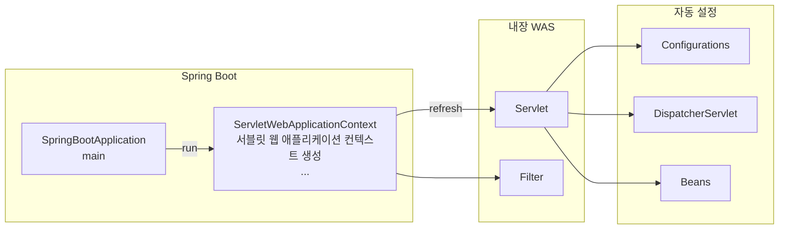
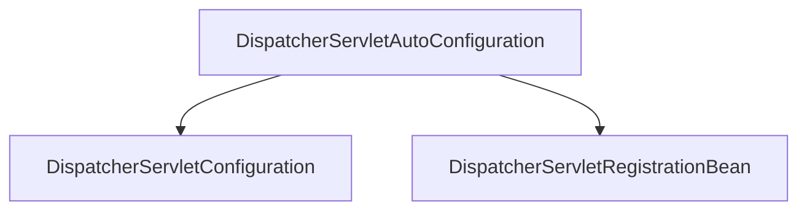
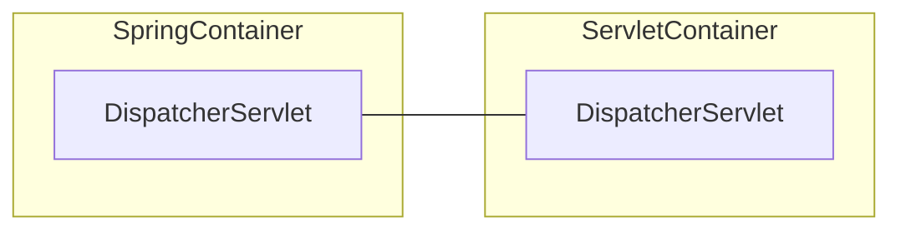
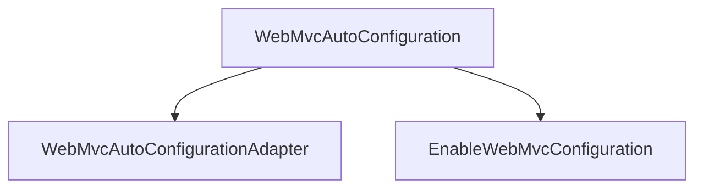
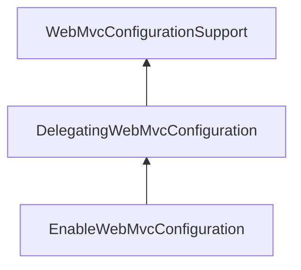

# 스프링 웹 MVC 초기화
## 서블릿 컨테이너 및 스프링 컨테이너


### 서블릿 컨테이너 & 스프링 컨테이너 연결
1. WAS가 구동되면 서블릿 컨테이너가 META-INF/services/jakarata/servlet.ServletContainerInitializer 파일을 검색하여 서블릿 3.0 ServletContainerInitializer 인터페이스를 구현한 클래스를 로드 한다.
2. ServletContainerInitializer 구현체는 @HandlesTypes(MyWebAppInitializer.class)와 같이 설정을 할 수 있으며 MyWebAppInitializer를 호출하여 스프링 애플리케이션을 초기화 한다.

### ServletContainerInitializer
```java
public interface ServletContainerInitializer {
    void onStartup(Set<Class<?>> c, ServletContext ctx) throws ServletException;
}
```
```java
@HandlesTypes(MyWebAppInitializer.class)
public class MyServletContainerInitializer implements ServletContainerInitializer {
    @Override
    public void onStartup(Set<Class<?>> c, ServletContext ctx) throws ServletException {
        for (Class<?> initClass : c) {
            MyWebAppInitializer initializer = (MyWebAppInitializer) initClass.getDeclaredConstructor().newInstance();
            initializer.onStartup(ctx);
        }
    }
}
```
```java
public class MyWebAppInitializerImpl implements MyWebAppInitializer {
    @Override
    public void onStartup(ServletContext context) throws ServletException {
        // 루트 컨텍스트 설정
        // 서블릿 전용 컨텍스트 설정
    }
}
```
### SpringServletContainerInitializer
* 스프링은 SpringServletContainerInitializer라는 구현체를 제공하며 이는 스프링 애플리케이션에서 서블릿 컨테이너와의 초기 상호작용을 담당한다.
* SpringServletContainerInitializer는 @HandlesTypes 어노테이션에 WebApplicationInitializer 타입이 선언되어 있으며 이는 WebApplicationInitializer 인터페이스를 구현한 클래스를 자동으로 탐색하고이를 호출하여 스프링 어플리케이션을 초기화 한다.



### WebApplicationInitializer
* 스프링 애플리케이션이 구동되면 WebApplicationInitializer 타입의 클래스가 실행되고 여기서 스프링 컨테이너 초기화 및 설정 작업이 이루어진다.

```java
public interface WebApplicationInitializer {
    void onStartup(ServletContext servletContext) throws ServletException; 
}
```
```java
public class MyWebAppInitializer implements WebApplicationInitializer {
    @Override
    public void onStartup(ServletContext servletContext) throws ServletException {
        // 루트 컨텍스트 설정
        AnnotationConfigWebApplicationContext rootContext = new AnnotationConfigWebApplicationContext();
        rootContext.register(RootConfig.class);
        servletContext.addListener(new ContextLoaderListener(rootContext));
        
        // 서블릿 컨텍스트 설정
        AnnotationConfigWebApplicationContext servletContext = new AnnotationConfigWebApplicationContext();
        context.setServletContext(servletContext);
        context.register(AppConfig.class);
        ServletRegistration.Dynamic servlet = servletContext.addServlet("dispatcher", new DispatcherServlet(context));
        servlet.setLoadOnStartup(1);
        servlet.addMapping("/");
    }
}
```


### Spring Boot 애플리케이션 초기화
* 스프링 부트 애플리케이션이 구동되면 내부적으로 WAS 가 실행되고 자동설정에 의해 스프링 컨테이너 초기화 및 설정 작업이 이루어진다


* 스프링 부트는스프링 컨테이너 객체 생성 및 초기화 작업을 자동으로 수행하며 여러 다양한 빈들을 자동설정에 의해 생성해 준다
* 스프링 부트는웹 어플리케이션 컨텍스트 하나만 생성해서 빈들을 관리한다
* 스프링 부트는 기본 스프링 프레임워크와는 달리 DispatcherServlet 를 빈으로 등록해서 관리하고 있다


## 초기화 클래스들
### 개요
* 스프링 부트는 웹 MVC 초기화와 실행을 위한 여러 빈을 생성하고 초기 값들을 설정하기 위한 여러 클래스들을 정의하고 있다.

### WebMvcProperties
* 스프링 MVC의 여러 속성들을 환경설정파일(properties, yml)을 통해 설정할 수 있다.

### DispatcherServletAutoConfiguration

* DispatcherServletConfiguration: DispatcherServlet 빈 등록
* DispatcherServletRegistrationBean: DispatcherServlet 서블릿 등록

### DispatcherServlet 컨테이너 관리
* DispatcherServlet은 스프링 MVC에서 생성하는 유일한 서블릿으로서 서블릿 컨테이너 및 스프링 빈으로서 스프링 컨테이너에서 관리한다.


### WebMvcAutoConfiguration
* @EnableWebMvc를 명시적으로 사용하지 않을 경우 스프링 부트 기반 스프링 MVC 설정을 자동으로 구성한다.
* @EnableWebMvc를 선언하면 WebMvcConfigurationSupport 빈이 생성되어 자동설정은 실행 되지 않는다.
* 메시지 컨버터, 뷰 리졸버, 포맷터, 인터셉터, 리소스 핸들러 등 Web MVC에서 자주 사용하는 Bean들이 이 클래스를 통해 자동 구성된다.
* @SpringBootApplication 만 붙였는데 모든 MVC 기능이 자동으로 작동할까?”라는 질문에 대한 답을 가장 직접적으로 보여주는 클래스
* WebMvcConfigurer 인터페이스를 구현한 추상 클래스로서 스프링 부트에서 제공하는 여러 기본 MVC 설정을 제공하며(ViewResolvers, Formatter, ResourceHandler..) 사용자가 직접 WebMvcConfigurer 인터페이스를 직접 구현하여 커스트 마이징 할 수 있다.
* 스프링 MVC의 핵심 설정을 제공하는 클래스로서 WebMvcConfigurationSupport를 상속받아 스프링 MVC에서 필요한 다양한 설정을 구성한다.



### EnableWebMvcConfiguration
* 전통적인 스프링 MVC에서 @EnableWebMvc를 사용할 때 MVC 구성에 필요한 핵심 Bean 등록(핸들러 매핑, 핸들러 어댑터, 뷰 리졸버 등)을 담당하는 추상 클래스로서스프링 MVC의 ‘기본 골격’이라고 볼 수 있다.
* WebMvcConfigurationSupport를 확장하고 내부적으로 여러 개의 WebMvcConfigurer(개발자가 작성한 커스텀 설정 클래스들)를 찾아서 적용(Delegation)해 주는 역할을 한다.
* @EnableWebMvc 또는 스프링 부트가 제공하는 자동 설정과 사용자가 정의한 WebMvcConfigurer 들을 연결해 주는 위임 클래스라 볼 수 있다.


1. 핸들러 매핑 및 핸들러 어댑터 설정
   * RequestMappingHandlerMapping, RequestMappingHandlerAdapter, ExceptionHandlerExceptionResolver 등의 다양한 핸들러 매핑과 어댑터를 설정한다.
2. 뷰 리졸버(ViewResolver) 설정
   *  뷰 리졸버는 컨트롤러에서 반환된 뷰 이름을 실제 뷰로 변환하는 역할을 한다.
3. MessageConverters 설정
   * 메시지 컨버터는 요청과 응답을 객체로 변환하거나객체를 JSON이나 XML과 같은 형식으로 변환하는 역할을 한다.
4. Validator와 Formatting 설정
   * Validator와 ConversionService를 설정하여 데이터 유효성 검사와 포매팅을 처리하는데 주로 폼 데이터 바인딩이나 데이터 검증에 사용된다.
5. 인터셉터(Interceptor) 및 기타 커스터마이징 포인트
   * 다양한 인터셉터를 추가하거나 설정할 수 있는 확장 포인트를 제공한다. 이를 통해 요청 전후에 특정 로직을 삽입할 수 있다.
6. 정적 리소스 제공 설정
   * 정적 리소스(예: CSS, JavaScript, 이미지 파일 등)를 제공하기 위한 설정을 포함하고 있다.

### WebMvcConfigurer
* WebMvcConfigurer 는 Web MVC 관련 설정을 커스터마이징할 수 있는 다양한 메서드를 정의하고 있으며 스프링 부트가 기본적으로 제공하는 자동 구성을 유지하면서필요한 부분만 맞춤형으로 설정할 수 있다.
* 예를 들어 정적 리소스 매핑(addResourceHandlers), CORS 설정(addCorsMappings), 메시지 컨버터 등록(configureMessageConverters), 인터셉터 추가(addInterceptors) 등 MVC 전반에 걸친 세부 설정들을 손쉽게 추가하거나 변경할 수 있다.
