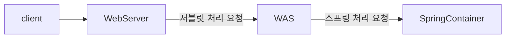
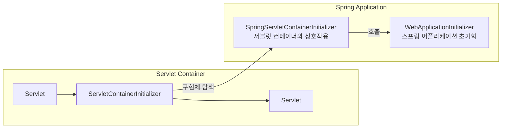
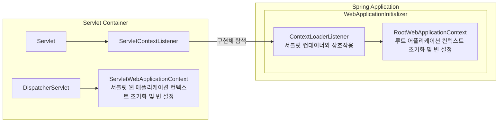
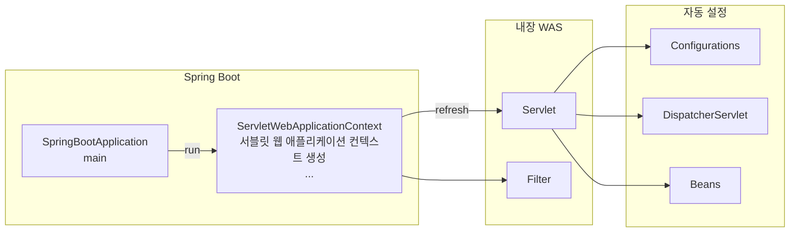

# 스프링 웹 MVC 초기화
## 서블릿 컨테이너 및 스프링 컨테이너


### 서블릿 컨테이너 & 스프링 컨테이너 연결
1. WAS가 구동되면 서블릿 컨테이너가 META-INF/services/jakarata/servlet.ServletContainerInitializer 파일을 검색하여 서블릿 3.0 ServletContainerInitializer 인터페이스를 구현한 클래스를 로드 한다.
2. ServletContainerInitializer 구현체는 @HandlesTypes(MyWebAppInitializer.class)와 같이 설정을 할 수 있으며 MyWebAppInitializer를 호출하여 스프링 애플리케이션을 초기화 한다.

### ServletContainerInitializer
```java
public interface ServletContainerInitializer {
    void onStartup(Set<Class<?>> c, ServletContext ctx) throws ServletException;
}
```
```java
@HandlesTypes(MyWebAppInitializer.class)
public class MyServletContainerInitializer implements ServletContainerInitializer {
    @Override
    public void onStartup(Set<Class<?>> c, ServletContext ctx) throws ServletException {
        for (Class<?> initClass : c) {
            MyWebAppInitializer initializer = (MyWebAppInitializer) initClass.getDeclaredConstructor().newInstance();
            initializer.onStartup(ctx);
        }
    }
}
```
```java
public class MyWebAppInitializerImpl implements MyWebAppInitializer {
    @Override
    public void onStartup(ServletContext context) throws ServletException {
        // 루트 컨텍스트 설정
        // 서블릿 전용 컨텍스트 설정
    }
}
```
### SpringServletContainerInitializer
* 스프링은 SpringServletContainerInitializer라는 구현체를 제공하며 이는 스프링 애플리케이션에서 서블릿 컨테이너와의 초기 상호작용을 담당한다.
* SpringServletContainerInitializer는 @HandlesTypes 어노테이션에 WebApplicationInitializer 타입이 선언되어 있으며 이는 WebApplicationInitializer 인터페이스를 구현한 클래스를 자동으로 탐색하고이를 호출하여 스프링 어플리케이션을 초기화 한다.



### WebApplicationInitializer
* 스프링 애플리케이션이 구동되면 WebApplicationInitializer 타입의 클래스가 실행되고 여기서 스프링 컨테이너 초기화 및 설정 작업이 이루어진다.

```java
public interface WebApplicationInitializer {
    void onStartup(ServletContext servletContext) throws ServletException; 
}
```
```java
public class MyWebAppInitializer implements WebApplicationInitializer {
    @Override
    public void onStartup(ServletContext servletContext) throws ServletException {
        // 루트 컨텍스트 설정
        AnnotationConfigWebApplicationContext rootContext = new AnnotationConfigWebApplicationContext();
        rootContext.register(RootConfig.class);
        servletContext.addListener(new ContextLoaderListener(rootContext));
        
        // 서블릿 컨텍스트 설정
        AnnotationConfigWebApplicationContext servletContext = new AnnotationConfigWebApplicationContext();
        context.setServletContext(servletContext);
        context.register(AppConfig.class);
        ServletRegistration.Dynamic servlet = servletContext.addServlet("dispatcher", new DispatcherServlet(context));
        servlet.setLoadOnStartup(1);
        servlet.addMapping("/");
    }
}
```


### Spring Boot 애플리케이션 초기화
* 스프링 부트 애플리케이션이 구동되면 내부적으로 WAS 가 실행되고 자동설정에 의해 스프링 컨테이너 초기화 및 설정 작업이 이루어진다


* 스프링 부트는스프링 컨테이너 객체 생성 및 초기화 작업을 자동으로 수행하며 여러 다양한 빈들을 자동설정에 의해 생성해 준다
* 스프링 부트는웹 어플리케이션 컨텍스트 하나만 생성해서 빈들을 관리한다
* 스프링 부트는 기본 스프링 프레임워크와는 달리 DispatcherServlet 를 빈으로 등록해서 관리하고 있다


## 초기화 클래스들