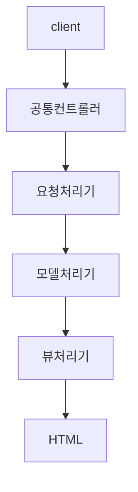
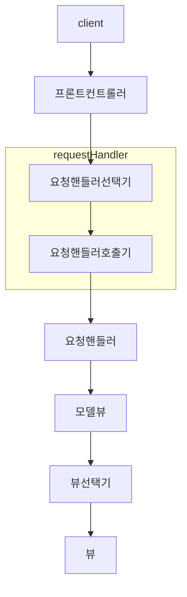
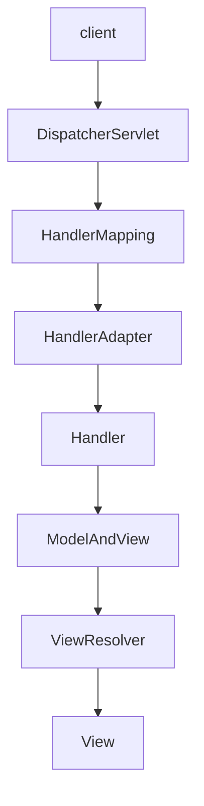
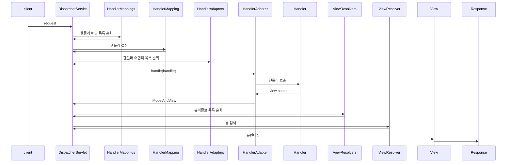
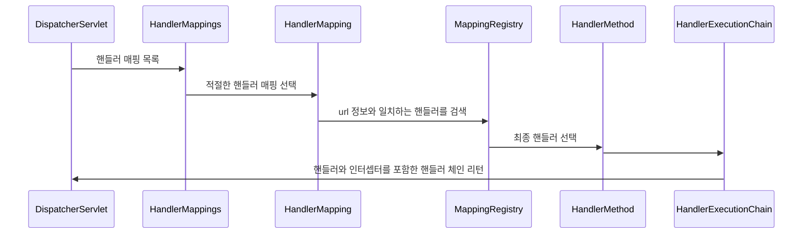
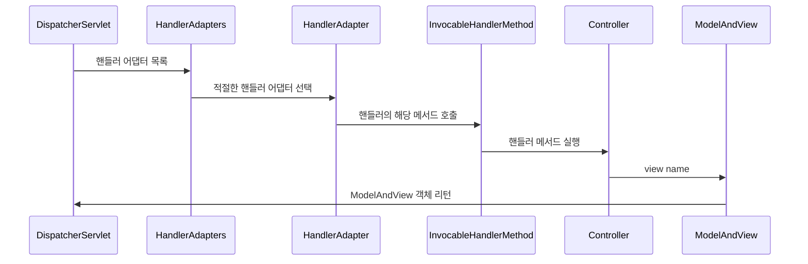
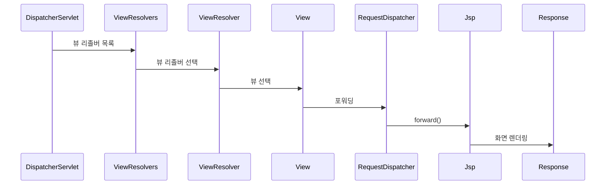
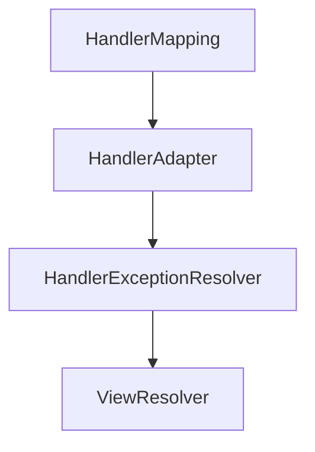
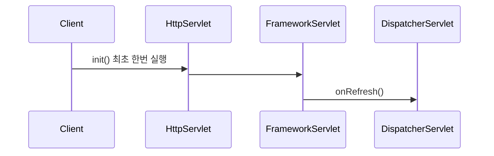
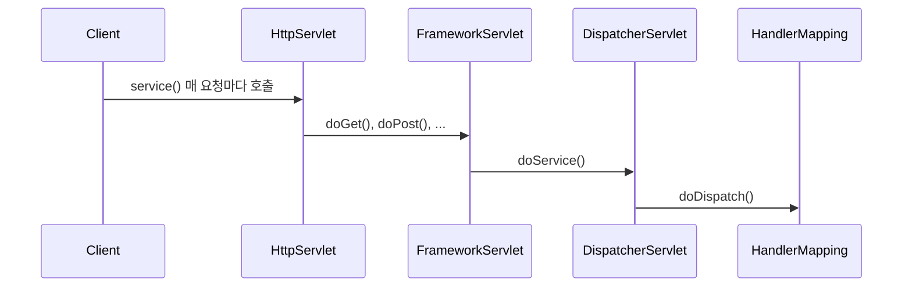

# 스프링 웹 MVC 기본
## 아키텍처 이해
* 스프링 웹 MVC의 전체 아키텍처 구조를 이해하기 위해서 먼저 큰 흐름을 파악하고 세부적인 기능을 살펴보도록 한다.
* 클라이언트가 요청을 하게 되면 서버에서 요청을 처리하기 위해서 어떤 기능들이 필요한지 나열해 보도록 한다.

> 최소한 4가지 흐름의 역할을 맡을 객체가 필요

* 공통컨트롤러: 모든 클라이언트의 요청을 한 곳에서 받아서 공통으로 처리하는 객체
* 요청처리기: 공통컨트롤러로부터 해당 요청을 받아 실질적으로 요청을 처리하는 객체
* 모델처리기: 요청 처리 중 생성하거나 전달받은 데이터를 저장하는 객체
* 뷰처리기: 요청을 처리한 후 화면을 렌더링 하고 응답하는 객체



* 프론트컨트롤러: 모든 클라이언트의 요청을 한 곳에서 받아 공통으로 처리하는 객체
* 요청핸들러선택기: 여러 요청 핸들러 중 현재 요청을 처리하기 적합한 핸들러를 탐색하고 선택하는 객체
* 요청핸들러호출기: 선택한 요청 핸들러를 호출하여 실행시키는 객체
* 요청핸들러: 실질적으로 현재 요청을 처리하는 객체
* 모델뷰: 요청 처리중 생성되거나 전달받은 데이터와 뷰 정보를 저장하는 객체
* 뷰선택기: 여러 뷰 중 현재 응답을 처리할 적절한 뷰를 선택하는 객체
* 뷰: 화면을 렌더링 하는 객체





### HandlerMapping (핸들러 검색)
* 클라이언트의 요청을 처리할 핸들러를 검색한다.
* 핸들러는 요청을 처리할 실제 빈 컨트롤러와 호출 메서드의 정보를 가지고 있다.



### HandlerAdapter (핸들러 호출)
* 클라이언트의 요청을 처리할 핸들러를 실행한다.



### ViewResolver & View (화면 처리)
* 뷰 리졸버를 통해 뷰를 선택하고 최종 응답 한다


## DispatcherServlet 초기화 및 요청 처리
### 개요
* DispatcherServlet은 스프링 MVC의 핵심 프론트 컨트롤러로모든 HTTP 요청을 중앙에서 받아 처리하는 역할을 한다.
* DispatcherServlet은 요청을 적절한 핸들러(일반적으로 컨트롤러)로 라우팅하고 요청 처리 후에는 적절한 뷰를 선택하여 응답을 반환한다.
* DispatcherServlet은 핸들러 매핑, 뷰 리졸버, 인터셉터 등을 조정하여 요청 처리 흐름을 관리하고스프링 MVC 애플리케이션에서 중심적인 역할을 수행한다.

### 핵심 클래스
* HandlerMapping: HandlerMapping 클라이언트 요청을 적절한 핸들러(컨트롤러 등)와 매핑하고, 이 과정에서 요청 전후에 실행할 인터셉터 목록도 함께 관리한다.
* HandlerAdapter: DispatcherServlet가 요청에 매핑된 핸들러를 호출할 때핸들러의 호출 방식에 관계없이 일관되게 동작할 수 있도록 처리한다.
* HandlerExceptionResolver: 예외가 발생했을 때 이를 적절하게 처리하는 전략을 제공한다. 예를 들어, 특정 핸들러로 예외를 전달하거나, 오류 페이지를 보여주는 방식으로 처리할 수 있다.
* ViewResolver: 컨트롤러가 반환한 뷰 이름을 실제 뷰(예: JSP 페이지, Thymeleaf 템플릿)로 변환하여 응답으로 렌더링할 수 있도록 한다.
* LocaleResolver, LocaleContextResolver: 사용자가 요청한 언어와 지역 설정(로케일)을 해석하여 이 정보에 맞는 국제화된 뷰를 제공할 수 있게 한다.(다국어처리)
* MultipartResolver: 브라우저에서 파일 업로드와 같은 멀티파트 요청을 처리한다.
* FlashMapManager: 리다이렉션 후에 속성을 전달할 수 있도록 데이터를 임시로 저장하고 전달하는 역할을 한다. 예를 들어, 폼 제출 후 리다이렉션된 페이지에서 메시지를 보여줄 때 사용할 수 있다.

### 핵심 인터페이스


## DispatcherServlet init() / service()
### 개요
* DispatcherServlet은 요청이 시작되면 서블릿의 생명주기에 따라 init() 메서드와 service() 메서드가 실행되어 초기화 작업 및 실제 요청을 처리하게 된다.

### init()
* 요청이 시작되면 DispatcherServlet의 init() 메서드가 호출되며 최초 한번 실행된다.
* WebApplicationContext를 생성 및 초기화하며HandlerMapping, HandlerAdapter, ViewResolver 등의 필수 구성요소를 초기화하고 모든 요청을 처리할 준비를 완료한다.



### service()
* 매 요청 마다 실행되는 메서드로 HTTP 요청을 분석하여 적합한 핸들러(Controller)를 찾고 실행하는 역할을 한다.
* 실행 결과를 기반으로 뷰(View)를 렌더링하여 클라이언트에게 응답을 반환한다.



#### doDispatch()
* 실제 핸들러로 요청을 디스패치하는 작업을 처리한다.
* 모든 HTTP 메서드는 doDispatch() 메서드에 의해 처리가 이루어진다.

```java
protected void doDispatch(HttpServletRequest request, HttpServletResponse response) {
    //현재 요청을 처리할 핸들러 검색
    HandlerExecutionChain mappedHandler = getHandler(request);

    // 현재 요청에 대한 핸들러 어댑터를 결정 
    HandlerAdapter ha = getHandlerAdapter(mappedHandler.getHandler());

    // 전 처리 인터셉터 수행
    if (!mappedHandler.applyPreHandle(request, response)) {
        return;
    }

    // 실제 핸들러 호출 후 ModelAndView  반환
    ModelAndView mv = ha.handle(request, response, mappedHandler.getHandler());

    // 후 처리 인터셉터 수행
    mappedHandler.applyPostHandle(request, response, mv);

    // 뷰 이름 확인
    String viewName = mv.getViewName();

    // 뷰 리졸버를 통해 뷰 선택
    View view = resolveViewName(viewName, mv.getModelInternal(), locale, request);

    // 뷰 렌더링
    view.render(mv.getModelInternal(), request, response);
}
```