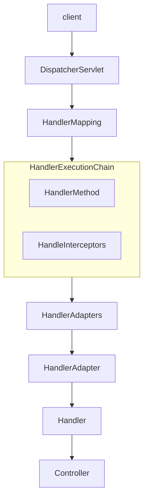
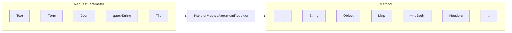
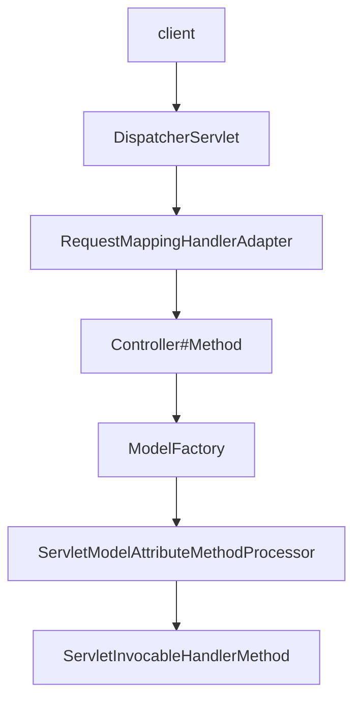
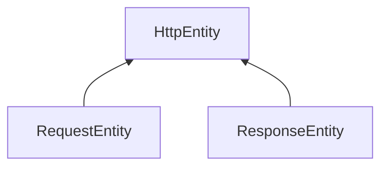
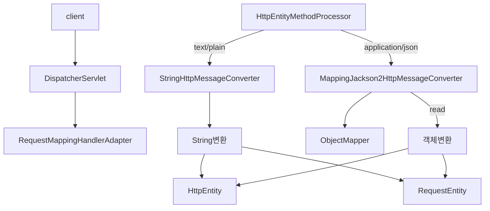

# 스프링 웹 MVC 활용 - HandlerAdapter
## HandlerAdapter 이해
### 개요
* HandlerAdapter는 스프링 MVC에서 핸들러(Handler)를 호출하는 역할을 하는 인터페이스이다.
* HandlerAdapter는 다양한 타입의 핸들러들이 일관된 방식으로 호출 될 수 있도록 해주며 핸들러가 다양한 타입으로 정의되더라도 그에 맞는 호출 방식을 제공해 준다.
* 요청이 들어왔을 때 어떤 핸들러가 해당 요청을 처리할지 결정하는 것이 HandlerMapping이라면 HandlerAdapter는 결정된 핸들러를 호출하여 실행하는 역할을 한다.

### 구조
* HttpRequestHandlerAdapter
  *  HttpRequestHandler 인터페이스를 구현하여 요청을 처리할 수 있도록 해준다.
* RequestMappingHandlerAdapter
  *  @RequestMapping 어노테이션으로 매핑된 메서드를 처리하는 클래스로서 대부분 이 클래스가 사용된다.
* SimpleControllerHandlerAdapter
  * 일반적인 Controller 인터페이스를 구현하여 요청을 처리할 수 있도록 해준다.

### HandlerAdapter 설계 의도
* HandlerAdapter는 HandlerMapping이 어떤 타입의 핸들러를 결정하더라도 타입과 상관없이 공통된 방식으로 핸들러를 호출할 수 있어야 한다.
* HandlerAdapter는 HandlerMapping으로부터 전달받은 핸들러의 타입 정보를 분석해서 해당 핸들러를 지원하는지 여부를 판단하고 true 이면 핸들러를 호출한다.

### 요청 흐름도


### RequestMappingHandlerAdapter
* RequestMappingHandlerAdapter는 @RequestMapping 애노테이션이 적용된 컨트롤러 메서드를 처리하는 데 사용되는 어댑터이다.
* 이 어댑터는 HandlerMethod를 호출하고메서드의 인자와 반환 값을 처리하는 역할을 하며필요할 경우 사용자 정의 Argument Resolver 및 ReturnValueHandler 를 구현하여 설정 할 수 있다.

### Handler Methods
* @RequestMapping 이 선언된핸들러 메서드는 메서드에 전달되는 인자와 반환 값을 다양한 타입과 방식으로 유연하게 설정할 수 있다.
* 메서드 호출과 반환을 자유롭게 구현하기 위해서는 호출에 필요한 인자 정보와 반환에 필요한 타입 정보를 알 수 있어야 한다. 이것을 스프링에서는 Method Arguments & Return Values로 나누어 API 를 제공하고 있다.

## Method Arguments
### 개요
* 스프링의 메서드 매개변수(Method Arguments)는 컨트롤러 메서드에서 HTTP 요청 데이터를 직접 접근하고 처리할 수 있도록 다양한 매개변수를 지원한다.
* 요청의 URL, 헤더, 본문, 쿠키, 세션 데이터 등과 같은 정보를 자동으로 매핑하여 개발자가 이를 쉽게 활용할 수 있도록 제공한다.

### HandlerMethodArgumentResolver
* HTTP 요청과 관련된 데이터를 컨트롤러 메서드의 파라미터로 변환하는 작업을 담당하는 클래스이다.
* 다양한 유형의 파라미터(예: @RequestParam, @PathVariable, @RequestBody 등)를 처리하기 위해 여러 HandlerMethodArgumentResolver 기본 구현체를 제공한다.
* 개발자가 필요에 따라 HandlerMethodArgumentResolver 인터페이스를 직접 구현할 수 있다.



### HandlerMethodArgumentResolver 설계 의도
```java
@RestController
public class RestApiController {
    
    @GetMapping("/index")
    public String index(@RequestParam("name") String name, @RequestParam("age") String age, User user){
        ...    
    }
}
```
1) 클래스와 호출 메서드의 시그니처 정보
   * 스프링은 HandlerMapping을 통해 매핑한 핸들러에 RestApiController와 public String index(String name, String age, User user) 와 같은 정보를 저장한다.
2) 메서드 매개변수 개수만큼 각 타입별로 바인딩할 데이터를 생성해서 메서드 호출 시 전달해 주어야 함 (리플렉션 기술 사용)
   * 스프링은 메서드 매개변수의 값을 요청 파라미터로부터 추출해서 생성하는데 이 역할을 하는 클래스가 바로 HandlerMethodArgumentResolver이다.

## 메서드 기본 매개변수
### 개요
* 스프링 MVC에서 메서드 파라미터에 공통적으로 선언할 수 있는 기본 인자들이 있으며 요청 및 응답 처리, 세션 관리, 인증 정보 접근 등 다양한 상황에서 적절하게 사용될 수 있다.
* WebRequest, NativeWebRequest, HttpSession, Principal, HttpMethod, Reader, Writer에 대해 살펴 본다.

### WebRequest / NativeWebRequest
* WebRequest와 NativeWebRequest는 웹 요청에 대한 다양한 정보를 제공하는 객체로서 HttpServletRequest 보다 더 많은 메서드와 웹 요청 전반에 쉽게 접근한다.
```java
@GetMapping("/example")
public String handleWebRequest(WebRequest webRequest, NativeWebRequest nativeWebRequest) {
    String paramValue = webRequest.getParameter("name");
    String headerValue = webRequest.getHeader("User-Agent");

    long requestTime = webRequest.getTimestamp();

    HttpServletRequest request = nativeWebRequest.getNativeRequest(HttpServletRequest.class);
    Cookie[] cookies = request.getCookies();
    if (cookies != null) {
        Arrays.stream(cookies)
                .map(cookie -> cookie.getName() + "=" + cookie.getValue());
        return "Parameter value: " + param;
    }
 }
```
### HttpSession
* HttpSession은 서버에 저장된 세션 데이터를 다룰 수 있게 해주는 객체로서 사용자의 세션 정보를 읽거나 설정할 수 있다.
```java
@GetMapping("/session")
public String handleHttpSession(HttpSession session) {
    session.setAttribute("user", "leaven ");
    return "Session set with user: leaven ";
}
```

### Principal
* Principal은 현재 인증된 사용자의 정보를 나타내는 객체로서 사용자 이름이나 인증된 사용자와 관련된 데이터를 제공해 준다.
* 스프링 시큐리티와 통합되어 제공하는 기능이다.
```java
@GetMapping("/user")
public String handlePrincipal(Principal principal) {
    return "Logged in user: " + principal.getName();
}
```

### HttpMethod
* HttpMethod 는 요청 메서드(GET, POST 등)를 나타내며 현재 요청이 어떤 HTTP 메서드인지 확인할 수 있다.
```java
@PostMapping("/checkMethod")
public String handleHttpMethod(HttpMethod method) {
    if (method == HttpMethod.POST) {
        return "This is a POST request";
    }
    
    return "This is not a POST request";
}
```

### InputStream&Reader / OutputStream&Writer
* Reader는 요청 본문을 읽는 데 사용되며Writer는 응답 본문에 데이터를 작성하는 데 사용된다.
```java
@PostMapping("/readwrite")
public String handleReader(Reader reader, Writer writer) throws IOException {
    char[] buffer = new char[1024];
    int bytesRead = reader.read(buffer);
    System.out.println("Read " + bytesRead + " characters from request body");
    writer.write("This is the response body");
}
```

## @RequestParam
### 개요
* @RequestParam 애노테이션은 HTTP 요청의 파라미터를 메서드의 매개변수에 바인딩 되도록 해 준다.
* @RequestParam은 URL 쿼리 파라미터, 폼 데이터, 그리고 멀티파트 요청을 매핑하며 HTTP 본문 요청은 처리하지 않는다. (HttpMessageConverter가 처리)
* 주로 int, long 과같은 기본형, 기본형 래퍼 클래스, String형 매개변수를 바인딩할 때 사용하며 대부분의 객체 타입은 처리하지 않는다. (@ModelAttribute가 처리)
* 내부적으로 RequestParamMethodArgumentResolver 구현체가 사용되며 request.getParameterValues()와 같은 API 를 사용하여 바인딩을 해결하고 있다.

### 구조
* name: 파라미터의 이름을 지정한다.
* required: 해당 파라미터의 필수 여부를 설정한다. 기본값은 true이다.
* defaultValue: 파라미터가 없을 경우 기본값을 설정한다.

### 기본 구현
```java
@RequestMapping("/greet")
public String greetUser(@RequestParam(name = "username") String username) {
    return "Hello, " + username;
}
```
* @RequestParam의 name 속성에 요청 파라미터와 바인딩 할 이름을 입력하고 매개변수 앞에 선언한다.
* 쿼리 파라미터와 폼데이터 모두 바인딩 되는데 getParameter()가 두 방식의 파라미터를 다 받기 때문이다.

## @PathVariable
### 개요
* @PathVariable은 @RequestMapping에 지정한 URI 템플릿 변수에 포함된 값을 메서드의 매개변수로 전달하기 위해 사용하는 애노테이션이다.
* @PathVariable은 GET, DELETE, PUT, POST 요청에서 사용 할 수 있다.

### URI 패턴
* 경로 변수에서 한 문자와 일치
```java
@GetMapping("/resources/ima?e.png") // /resources/image.png 또는 /resources/imaxe.png가 매치된다
public String getSingleCharacterMatch() {
    return "경로에서 한 문자만 일치하는 URL입니다.";
}
```

* 경로 변수에서 0개 이상의 문자와 일치
```java
@GetMapping("/resources/ *.png")
public String getSingleCharacterMatch() {
    return "경로에서0개이상의문자와일치하는URL입니다.";
}
```

* 여러 경로 변수와 일치
```java
@GetMapping("/resources/**")
public String getSingleCharacterMatch() {
    return "resources 디렉터리및그하위모든경로와일치합니다.";
}
```

### 구조
* name: URL에서 추출할 변수의 이름을 지정한다.
* required: 해당 파라미터의 필수 여부를 설정한다. 기본값은 true이다.
* value: name과 동일한 기능을 한다.

## @ModelAttribute
* @ModelAttribute는 스프링 MVC에서 주로 폼 데이터나 요청 파라미터를 모델 객체에 바인딩할 때 사용하는 애노테이션이다.
* 요청 파라미터를 특정 객체의 각 필드(요청 파라미터명과 일치)에 바인딩하고 이후 자동으로 모델에 추가하여 뷰에서 사용할 수 있게 한다.
* 일반적으로 기본형 타입(int, long, String ..)의 바인딩은 @RequestParam이 처리하고 객체 타입은 @ModelAttribute가 처리한다고 보면 된다.

### 데이터 바인딩 없이 모델에 접근
* 데이터 바인딩 없이 모델에 접근하고자 할 경우 @ModelAttribute(binding=false)로 설정하여 데이터 바인딩 없이 객체에 접근할 수 있다.
```java
@PostMapping("/update")
public String update(@ModelAttribute(binding=false) User user) {
    // user'는데이터바인딩없이접근가능
    return "result";
}
```

### 생성자 바인딩 : @BindParam
* @ModelAttribute는 요청 파라미터와 일치하는 생성자를 통해 객체를 생성할 수도 있으며 생성자 바인딩을 사용할 때는 @BindParam을 이용해 요청 파라미터의 이름을 매핑할 있다.
```java
@PostMapping("/account")
public String processAccount(@ModelAttribute Account account) {
    System.out.println("First Name: " + account.getFirstName());
    return "accountResult";
}
```
```java
public class Account {
    private final String firstName;
 
    public Account(@BindParam("first-name") String firstName) {
        this.firstName = firstName;
    }
}
```

### 경로 변수 or 요청 파라미터 객체 바인딩
* Converter<String, T>가 등록되어 있고 @ModelAttribute 속성 이름이 경로 변수와 일치하는 경우 Converter를 사용하여 모델 객체를 가져올 수 있다.

### 메서드에 @ModelAttribute 선언
* 컨트롤러에서 모델에 데이터를 추가하는 역할을 한다. 이 경우메서드가 리턴한 객체가 자동으로 모델에 추가된다.
* 주로 뷰에서 공통적으로 사용되는 데이터를 미리 모델에 추가할 때 사용된다. 예를 들어드롭다운 리스트에 넣을 데이터나 공통적으로 사용되는 객체 등을 미리 준비하는 경우 유용하다.

```java
@ModelAttribute("user")
public AccountDto addUser() { // 먼저호출된다
    return new AccountDto("leaven", "1234");
}

@GetMapping("/form")
public String showForm(Model model, AccountDto account) {
    return "userForm";
}
```
### 흐름도



## HttpEntity / RequestEntity
### 개요
* HTTP 요청이 파라미터나 폼 데이터가 아닌 요청 본문(Body)일 경우 앞서 보았던 @RequestParam이나 @ModelAttribute는 요청을 매개변수에 바인딩 할 수 없다.
* 일반적으로 헤더정보가 Content-type=application/ json과 같이 되어 있는 HTTP 본문 요청은 getParameter()로 읽어 드릴 수 없으며 직접 본문 데이터를 파싱해서 읽는 방식으로 처리해야 한다.

### HttpServletRequest – InputStream, Reader
* HTTP 요청 본문(Body)은 HttpServletRequest의 InputStream 또는 Reader를 통해 접근할 수 있으며 요청 본문은 getInputStream() 또는 getReader() 메서드를 사용하여 읽을 수 있다.

```java
@PostMapping("/readbody")
public String readBody(HttpServletRequest request) throws IOException {
   StringBuilder requestBody = new StringBuilder();
    
   try (BufferedReader reader = request.getReader()) {
       String line;
       while ((line = reader.readLine()) != null) {
           requestBody.append(line);
       }
   }
   return "Received Body: " + requestBody.toString();
}
```

### HttpEntity
* HttpEntity는 기존 HttpServletRequest나 HttpServletResponse를 사용하여 요청 및 응답 데이터를 처리하는 복잡성을 해결하기 위해 도입되었다.
* HttpHeaders와 Body 데이터를 하나의 객체로 통합하였고 JSON, XML, 문자열, 바이너리 데이터 등 다양한 본문 데이터 형식을 처리 가능하게 하였다.
* 내부적으로 HttpMessageConverter 객체가 작동되어 본문을 처리한다.

### 구조
1. 생성자
   * HttpEntity<T>() - 본문과 헤더 없이 객체 생성.
   * HttpEntity<T>(T body) - 본문만 포함.
   * HttpEntity<T>(T body, HttpHeaders headers) - 본문과 헤더를 포함.
2. 메서드
   * T getBody() - 요청 또는 응답의 본문 데이터 반환.
   * HttpHeaders getHeaders() - 요청 또는 응답의 헤더 반환.
3. 상속 구조


### RequestEntity
* HttpEntity의 확장 버전으로 HTTP 메서드와 대상 URL도 포함하며 RestTemplate에서 요청을 준비하거나 @Controller 메서드에서 요청 입력을 나타낼 때 사용된다.

### 흐름도


## @RequestBody
## HttpMessageConverter
## @RequestHeader & @RequestAttribute & @CookieValue
## Model
## @SessionAttributes
## @SessionAttribute
## RedirectAttributes & Flash Attributes
## 커스텀 HandlerMethodArgumentResolver
## DataBinder
## @InitBinder