# 스프링 웹 MVC 활용 - HandlerAdapter
## HandlerAdapter 이해
### 개요
* HandlerAdapter는 스프링 MVC에서 핸들러(Handler)를 호출하는 역할을 하는 인터페이스이다.
* HandlerAdapter는 다양한 타입의 핸들러들이 일관된 방식으로 호출 될 수 있도록 해주며 핸들러가 다양한 타입으로 정의되더라도 그에 맞는 호출 방식을 제공해 준다.
* 요청이 들어왔을 때 어떤 핸들러가 해당 요청을 처리할지 결정하는 것이 HandlerMapping이라면 HandlerAdapter는 결정된 핸들러를 호출하여 실행하는 역할을 한다.

### 구조
* HttpRequestHandlerAdapter
  *  HttpRequestHandler 인터페이스를 구현하여 요청을 처리할 수 있도록 해준다.
* RequestMappingHandlerAdapter
  *  @RequestMapping 어노테이션으로 매핑된 메서드를 처리하는 클래스로서 대부분 이 클래스가 사용된다.
* SimpleControllerHandlerAdapter
  * 일반적인 Controller 인터페이스를 구현하여 요청을 처리할 수 있도록 해준다.

### HandlerAdapter 설계 의도
* HandlerAdapter는 HandlerMapping이 어떤 타입의 핸들러를 결정하더라도 타입과 상관없이 공통된 방식으로 핸들러를 호출할 수 있어야 한다.
* HandlerAdapter는 HandlerMapping으로부터 전달받은 핸들러의 타입 정보를 분석해서 해당 핸들러를 지원하는지 여부를 판단하고 true 이면 핸들러를 호출한다.

### 요청 흐름도
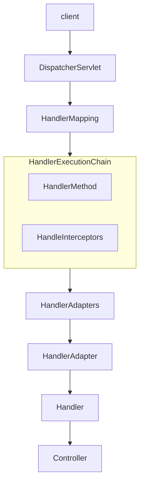

### RequestMappingHandlerAdapter
* RequestMappingHandlerAdapter는 @RequestMapping 애노테이션이 적용된 컨트롤러 메서드를 처리하는 데 사용되는 어댑터이다.
* 이 어댑터는 HandlerMethod를 호출하고메서드의 인자와 반환 값을 처리하는 역할을 하며필요할 경우 사용자 정의 Argument Resolver 및 ReturnValueHandler 를 구현하여 설정 할 수 있다.

### Handler Methods
* @RequestMapping 이 선언된핸들러 메서드는 메서드에 전달되는 인자와 반환 값을 다양한 타입과 방식으로 유연하게 설정할 수 있다.
* 메서드 호출과 반환을 자유롭게 구현하기 위해서는 호출에 필요한 인자 정보와 반환에 필요한 타입 정보를 알 수 있어야 한다. 이것을 스프링에서는 Method Arguments & Return Values로 나누어 API 를 제공하고 있다.

## Method Arguments
### 개요
* 스프링의 메서드 매개변수(Method Arguments)는 컨트롤러 메서드에서 HTTP 요청 데이터를 직접 접근하고 처리할 수 있도록 다양한 매개변수를 지원한다.
* 요청의 URL, 헤더, 본문, 쿠키, 세션 데이터 등과 같은 정보를 자동으로 매핑하여 개발자가 이를 쉽게 활용할 수 있도록 제공한다.

### HandlerMethodArgumentResolver
* HTTP 요청과 관련된 데이터를 컨트롤러 메서드의 파라미터로 변환하는 작업을 담당하는 클래스이다.
* 다양한 유형의 파라미터(예: @RequestParam, @PathVariable, @RequestBody 등)를 처리하기 위해 여러 HandlerMethodArgumentResolver 기본 구현체를 제공한다.
* 개발자가 필요에 따라 HandlerMethodArgumentResolver 인터페이스를 직접 구현할 수 있다.

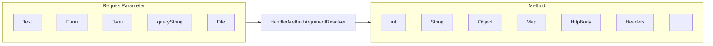

### HandlerMethodArgumentResolver 설계 의도
```java
@RestController
public class RestApiController {
    
    @GetMapping("/index")
    public String index(@RequestParam("name") String name, @RequestParam("age") String age, User user){
        ...    
    }
}
```
1) 클래스와 호출 메서드의 시그니처 정보
   * 스프링은 HandlerMapping을 통해 매핑한 핸들러에 RestApiController와 public String index(String name, String age, User user) 와 같은 정보를 저장한다.
2) 메서드 매개변수 개수만큼 각 타입별로 바인딩할 데이터를 생성해서 메서드 호출 시 전달해 주어야 함 (리플렉션 기술 사용)
   * 스프링은 메서드 매개변수의 값을 요청 파라미터로부터 추출해서 생성하는데 이 역할을 하는 클래스가 바로 HandlerMethodArgumentResolver이다.

## 메서드 기본 매개변수
### 개요
* 스프링 MVC에서 메서드 파라미터에 공통적으로 선언할 수 있는 기본 인자들이 있으며 요청 및 응답 처리, 세션 관리, 인증 정보 접근 등 다양한 상황에서 적절하게 사용될 수 있다.
* WebRequest, NativeWebRequest, HttpSession, Principal, HttpMethod, Reader, Writer에 대해 살펴 본다.

### WebRequest / NativeWebRequest
* WebRequest와 NativeWebRequest는 웹 요청에 대한 다양한 정보를 제공하는 객체로서 HttpServletRequest 보다 더 많은 메서드와 웹 요청 전반에 쉽게 접근한다.
```java
@GetMapping("/example")
public String handleWebRequest(WebRequest webRequest, NativeWebRequest nativeWebRequest) {
    String paramValue = webRequest.getParameter("name");
    String headerValue = webRequest.getHeader("User-Agent");

    long requestTime = webRequest.getTimestamp();

    HttpServletRequest request = nativeWebRequest.getNativeRequest(HttpServletRequest.class);
    Cookie[] cookies = request.getCookies();
    if (cookies != null) {
        Arrays.stream(cookies)
                .map(cookie -> cookie.getName() + "=" + cookie.getValue());
        return "Parameter value: " + param;
    }
 }
```
### HttpSession
* HttpSession은 서버에 저장된 세션 데이터를 다룰 수 있게 해주는 객체로서 사용자의 세션 정보를 읽거나 설정할 수 있다.
```java
@GetMapping("/session")
public String handleHttpSession(HttpSession session) {
    session.setAttribute("user", "leaven ");
    return "Session set with user: leaven ";
}
```

### Principal
* Principal은 현재 인증된 사용자의 정보를 나타내는 객체로서 사용자 이름이나 인증된 사용자와 관련된 데이터를 제공해 준다.
* 스프링 시큐리티와 통합되어 제공하는 기능이다.
```java
@GetMapping("/user")
public String handlePrincipal(Principal principal) {
    return "Logged in user: " + principal.getName();
}
```

### HttpMethod
* HttpMethod 는 요청 메서드(GET, POST 등)를 나타내며 현재 요청이 어떤 HTTP 메서드인지 확인할 수 있다.
```java
@PostMapping("/checkMethod")
public String handleHttpMethod(HttpMethod method) {
    if (method == HttpMethod.POST) {
        return "This is a POST request";
    }
    
    return "This is not a POST request";
}
```

### InputStream&Reader / OutputStream&Writer
* Reader는 요청 본문을 읽는 데 사용되며Writer는 응답 본문에 데이터를 작성하는 데 사용된다.
```java
@PostMapping("/readwrite")
public String handleReader(Reader reader, Writer writer) throws IOException {
    char[] buffer = new char[1024];
    int bytesRead = reader.read(buffer);
    System.out.println("Read " + bytesRead + " characters from request body");
    writer.write("This is the response body");
}
```

## @RequestParam
### 개요
* @RequestParam 애노테이션은 HTTP 요청의 파라미터를 메서드의 매개변수에 바인딩 되도록 해 준다.
* @RequestParam은 URL 쿼리 파라미터, 폼 데이터, 그리고 멀티파트 요청을 매핑하며 HTTP 본문 요청은 처리하지 않는다. (HttpMessageConverter가 처리)
* 주로 int, long 과같은 기본형, 기본형 래퍼 클래스, String형 매개변수를 바인딩할 때 사용하며 대부분의 객체 타입은 처리하지 않는다. (@ModelAttribute가 처리)
* 내부적으로 RequestParamMethodArgumentResolver 구현체가 사용되며 request.getParameterValues()와 같은 API 를 사용하여 바인딩을 해결하고 있다.

### 구조
* name: 파라미터의 이름을 지정한다.
* required: 해당 파라미터의 필수 여부를 설정한다. 기본값은 true이다.
* defaultValue: 파라미터가 없을 경우 기본값을 설정한다.

### 기본 구현
```java
@RequestMapping("/greet")
public String greetUser(@RequestParam(name = "username") String username) {
    return "Hello, " + username;
}
```
* @RequestParam의 name 속성에 요청 파라미터와 바인딩 할 이름을 입력하고 매개변수 앞에 선언한다.
* 쿼리 파라미터와 폼데이터 모두 바인딩 되는데 getParameter()가 두 방식의 파라미터를 다 받기 때문이다.

## @PathVariable
### 개요
* @PathVariable은 @RequestMapping에 지정한 URI 템플릿 변수에 포함된 값을 메서드의 매개변수로 전달하기 위해 사용하는 애노테이션이다.
* @PathVariable은 GET, DELETE, PUT, POST 요청에서 사용 할 수 있다.

### URI 패턴
* 경로 변수에서 한 문자와 일치
```java
@GetMapping("/resources/ima?e.png") // /resources/image.png 또는 /resources/imaxe.png가 매치된다
public String getSingleCharacterMatch() {
    return "경로에서 한 문자만 일치하는 URL입니다.";
}
```

* 경로 변수에서 0개 이상의 문자와 일치
```java
@GetMapping("/resources/ *.png")
public String getSingleCharacterMatch() {
    return "경로에서0개이상의문자와일치하는URL입니다.";
}
```

* 여러 경로 변수와 일치
```java
@GetMapping("/resources/**")
public String getSingleCharacterMatch() {
    return "resources 디렉터리및그하위모든경로와일치합니다.";
}
```

### 구조
* name: URL에서 추출할 변수의 이름을 지정한다.
* required: 해당 파라미터의 필수 여부를 설정한다. 기본값은 true이다.
* value: name과 동일한 기능을 한다.

## @ModelAttribute
* @ModelAttribute는 스프링 MVC에서 주로 폼 데이터나 요청 파라미터를 모델 객체에 바인딩할 때 사용하는 애노테이션이다.
* 요청 파라미터를 특정 객체의 각 필드(요청 파라미터명과 일치)에 바인딩하고 이후 자동으로 모델에 추가하여 뷰에서 사용할 수 있게 한다.
* 일반적으로 기본형 타입(int, long, String ..)의 바인딩은 @RequestParam이 처리하고 객체 타입은 @ModelAttribute가 처리한다고 보면 된다.

### 데이터 바인딩 없이 모델에 접근
* 데이터 바인딩 없이 모델에 접근하고자 할 경우 @ModelAttribute(binding=false)로 설정하여 데이터 바인딩 없이 객체에 접근할 수 있다.
```java
@PostMapping("/update")
public String update(@ModelAttribute(binding=false) User user) {
    // user'는데이터바인딩없이접근가능
    return "result";
}
```

### 생성자 바인딩 : @BindParam
* @ModelAttribute는 요청 파라미터와 일치하는 생성자를 통해 객체를 생성할 수도 있으며 생성자 바인딩을 사용할 때는 @BindParam을 이용해 요청 파라미터의 이름을 매핑할 있다.
```java
@PostMapping("/account")
public String processAccount(@ModelAttribute Account account) {
    System.out.println("First Name: " + account.getFirstName());
    return "accountResult";
}
```
```java
public class Account {
    private final String firstName;
 
    public Account(@BindParam("first-name") String firstName) {
        this.firstName = firstName;
    }
}
```

### 경로 변수 or 요청 파라미터 객체 바인딩
* Converter<String, T>가 등록되어 있고 @ModelAttribute 속성 이름이 경로 변수와 일치하는 경우 Converter를 사용하여 모델 객체를 가져올 수 있다.

### 메서드에 @ModelAttribute 선언
* 컨트롤러에서 모델에 데이터를 추가하는 역할을 한다. 이 경우메서드가 리턴한 객체가 자동으로 모델에 추가된다.
* 주로 뷰에서 공통적으로 사용되는 데이터를 미리 모델에 추가할 때 사용된다. 예를 들어드롭다운 리스트에 넣을 데이터나 공통적으로 사용되는 객체 등을 미리 준비하는 경우 유용하다.

```java
@ModelAttribute("user")
public AccountDto addUser() { // 먼저호출된다
    return new AccountDto("leaven", "1234");
}

@GetMapping("/form")
public String showForm(Model model, AccountDto account) {
    return "userForm";
}
```
### 흐름도

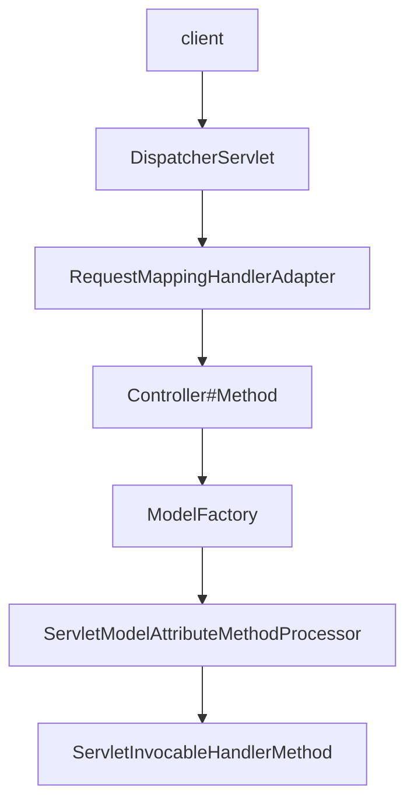

## HttpEntity / RequestEntity
### 개요
* HTTP 요청이 파라미터나 폼 데이터가 아닌 요청 본문(Body)일 경우 앞서 보았던 @RequestParam이나 @ModelAttribute는 요청을 매개변수에 바인딩 할 수 없다.
* 일반적으로 헤더정보가 Content-type=application/ json과 같이 되어 있는 HTTP 본문 요청은 getParameter()로 읽어 드릴 수 없으며 직접 본문 데이터를 파싱해서 읽는 방식으로 처리해야 한다.

### HttpServletRequest – InputStream, Reader
* HTTP 요청 본문(Body)은 HttpServletRequest의 InputStream 또는 Reader를 통해 접근할 수 있으며 요청 본문은 getInputStream() 또는 getReader() 메서드를 사용하여 읽을 수 있다.

```java
@PostMapping("/readbody")
public String readBody(HttpServletRequest request) throws IOException {
   StringBuilder requestBody = new StringBuilder();
    
   try (BufferedReader reader = request.getReader()) {
       String line;
       while ((line = reader.readLine()) != null) {
           requestBody.append(line);
       }
   }
   return "Received Body: " + requestBody.toString();
}
```

### HttpEntity
* HttpEntity는 기존 HttpServletRequest나 HttpServletResponse를 사용하여 요청 및 응답 데이터를 처리하는 복잡성을 해결하기 위해 도입되었다.
* HttpHeaders와 Body 데이터를 하나의 객체로 통합하였고 JSON, XML, 문자열, 바이너리 데이터 등 다양한 본문 데이터 형식을 처리 가능하게 하였다.
* 내부적으로 HttpMessageConverter 객체가 작동되어 본문을 처리한다.

### 구조
1. 생성자
   * HttpEntity<T>() - 본문과 헤더 없이 객체 생성.
   * HttpEntity<T>(T body) - 본문만 포함.
   * HttpEntity<T>(T body, HttpHeaders headers) - 본문과 헤더를 포함.
2. 메서드
   * T getBody() - 요청 또는 응답의 본문 데이터 반환.
   * HttpHeaders getHeaders() - 요청 또는 응답의 헤더 반환.
3. 상속 구조
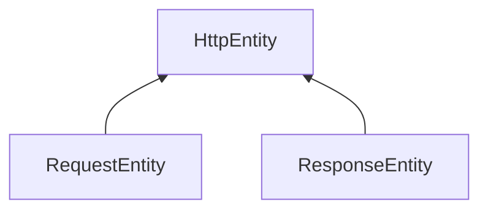

### RequestEntity
* HttpEntity의 확장 버전으로 HTTP 메서드와 대상 URL도 포함하며 RestTemplate에서 요청을 준비하거나 @Controller 메서드에서 요청 입력을 나타낼 때 사용된다.

### 흐름도
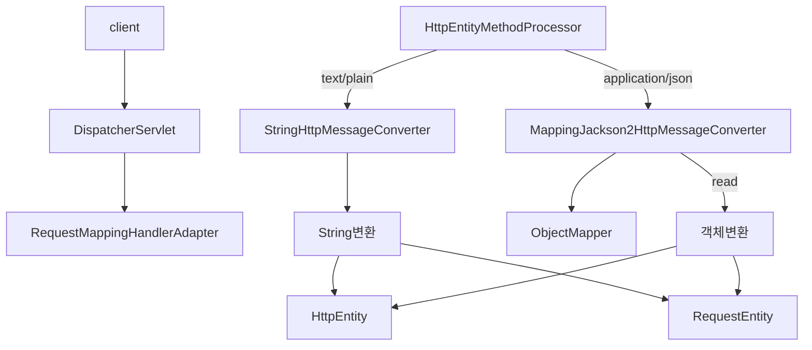

## @RequestBody
* @RequestBody는 HTTP 요청 본문(HTTP Body)을 자동으로 객체로 매핑하는데 사용되며 내부적으로 HttpMessageConverter 객체가 작동되어 본문을 처리한다.
* HttpEntity 및 RequestEntity도 요청 본문을 처리해 주지만 지정된 객체로 자동 매핑을 해 주지는 않는다.
* @Valid 애너테이션과 함께 사용하면 요청 본문의 유효성을 쉽게 검증할 수 있다.

### @RequestBody vsHttpEntity
* @RequestBody는 요청의 Content-Type 헤더를 기반으로 적절한 HttpMessageConverter를 선택하기 때문에 Content-Type 헤더가 올바르게 설정되어야 한다.
* @RequestBody는 생략하면 안된다. 생략할 경우 기본형은 @RequestParam, 객체 타입은 @ModelAttribute가 작동하게 되지만 정확한 결과를 보장할 수 없다.

### 구현 예제
```java
//  application/json 타입으로 JSON 데이터 받기
@PostMapping(consumes = MediaType.APPLICATION_JSON_VALUE)
public ResponseEntity<String> createUser(@RequestBody UserDto userDto) {    
    return ResponseEntity.ok("Username: " + userDto.getName());
}

// text/plain 타입으로 문자열 데이터 받기
@PostMapping(consumes = MediaType.TEXT_PLAIN_VALUE)
public ResponseEntity<String> handlePlainText(@RequestBody String message) {
    return ResponseEntity.ok("message: " + message);
}

// application/x-www-form-urlencoded 데이터 받기
@PostMapping(consumes = MediaType.APPLICATION_FORM_URLENCODED_VALUE)
public ResponseEntity<String> handleForm(@RequestBody MultiValueMap<String, String> formData) {
    String name = formData.getFirst("name");
    String email = formData.getFirst("email");
    return ResponseEntity.ok("Name = " + name + ", Email = " + email);
}

// Mixed Content-Type 지원 (application/json + text/plain)
@PostMapping(consumes = {MediaType.APPLICATION_JSON_VALUE, MediaType.TEXT_PLAIN_VALUE})
public ResponseEntity<String> handleMixedContent(@RequestBody Object data) {
    if (data instanceof String) {
        return ResponseEntity.ok("Received plain text: " + data);
    } else {
        UserDto userDto = (UserDto) data;
        return ResponseEntity.ok("User: " + userDto.getName());
    }
}
```

### 흐름도
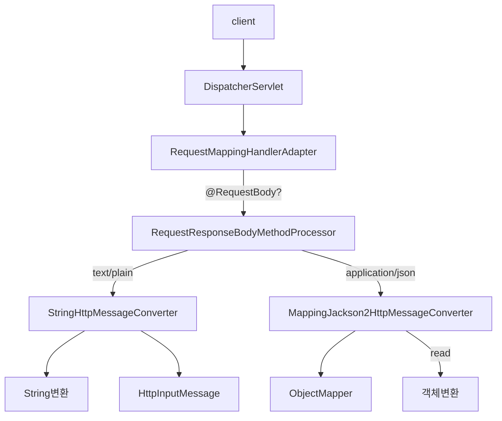

## HttpMessageConverter
### 개요
* HttpMessageConverter는 HTTP 요청과 응답의 바디(body) 내용을 객체로 변환하고객체를 HTTP 메시지로 변환하는데 사용되는 인터페이스이다.
* HttpMessageConverter는 클라이언트와 서버 간의 데이터를 직렬화/역직렬화하는 기능을 담당하며주로 JSON, XML, Plain Text와 같은 다양한 데이터 포맷을 지원한다.
* HttpMessageConverter는 주로 Rest API 통신에서 사용된다.

### 흐름도
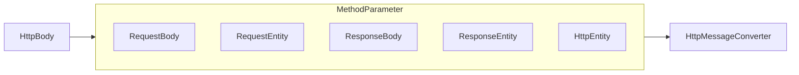
### HttpMessageConverter 요청 처리 흐름
### 흐름도
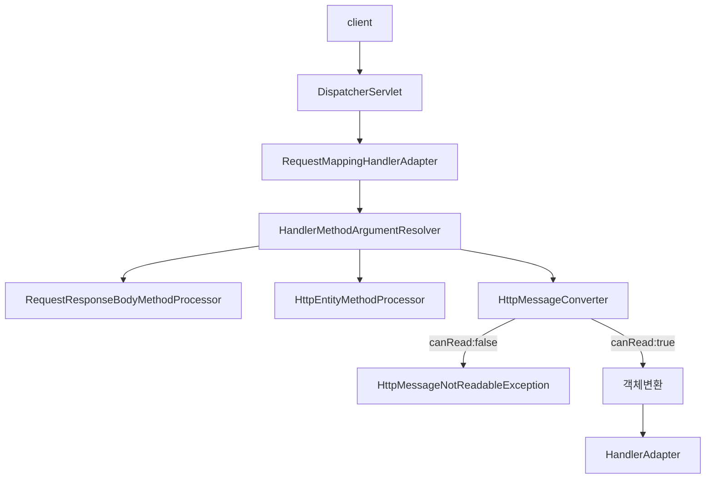
1. 클라이언트의 Content-Type 헤더
   * 클라이언트가 서버로 데이터를 전송한다. 이때 HTTP 헤더에 Content-Type을 포함하여 서버에 데이터 형식을 알린다.
2. ArgumentResolver 실행
   * Spring은 컨트롤러의 메서드 매개변수에 @RequestBody 혹은 HttpEntity 등이 선언 되었는지 확인한다.
   * 선언이 되었다면 HTTP 요청 본문 ArgumentResolver가 선택되고 ArgumentResolver는 HttpMessageConverter를 실행한다.
3. HttpMessageConverter 작동
   * HttpMessageConverter는 클라이언트의 Content-Type 헤더를 기준으로 요청 본문 데이터를 특정객체로 변환한다.

### HttpMessageConverter 응답 처리 흐름
### 흐름도
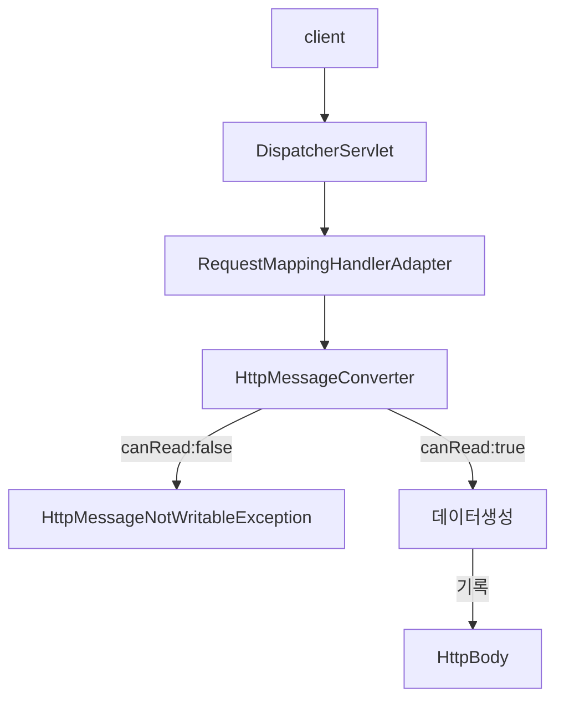
1. 클라이언트의 Accept 헤더
   * 클라이언트는 Accept 헤더를 통해 서버가 어떤 형식의 데이터를 반환해야 하는지 명시한다.
2. ReturnValueHandler 실행
   * Spring은 컨트롤러의 반환 타입에 @ResponseBody 또는 ResponseEntity가 선언되었는지 확인한다.
3. HttpMessageConverter 작동
   * HttpMessageConverter는 클라이언트의 Accept 헤더를 기준으로 데이터를 응답 본문에 기록한다.

### HttpMessageConverter 요청/응답 구조
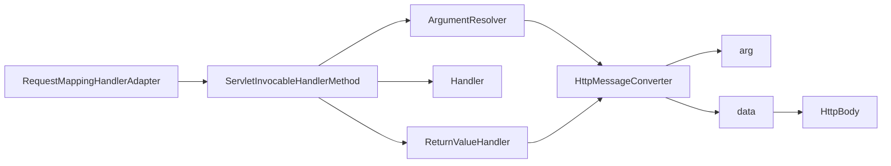

### HttpMessageConverter 주요 구현체
1. ByteArrayHttpMessageConverter
   * application/octet-stream과 같은 바이너리 데이터를 처리하며주로 파일 전송에 사용된다.
2. StringHttpMessageConverter
   * text/plain과 같은 문자열데이터를 String 객체로 변환하거나 String 객체를 text/plain 형식으로 변환하여 HTTP 본문에 넣는다.
3. ResourceHttpMessageConverter
   * Resource 타입의 데이터를 HTTP 요청과 응답으로 변환하거나 처리하는데 사용된다. 
4. MappingJackson2HttpMessageConverter
   * application/json 형식의 데이터를 파싱하여 Java 객체를 JSON으로 변환하거나 JSON을 Java 객체로 변환한다.
5. FormHttpMessageConverter
   * MultiValueMap + application/x-www-form-urlencoded 형식의 데이터를 파싱하여 MultiValueMap 형태로 변환한다.

### HttpMessageConverter 가 작동하지 않는 요청
1. GET 요청과 같은 본문이 없는 요청
   * GET, DELETE와 같은 HTTP 메서드는 일반적으로 본문을 포함하지 않으므로 HttpMessageConverter가 작동하지 않는다.
2. Content-Type 헤더가 지원되지 않는 요청
   * POST, PUT 등의 본문이 포함된 HTTP 요청이라도 Content-Type 헤더가 지원되지 않는 미디어 타입일 경우 HttpMessageConverter가 작동하지 않는다.
3. @RequestParam, @ModelAttribute를 사용하는 경우
    * @RequestParam, @ModelAttribute와 같은 애노테이션을 사용하여 쿼리 파라미터나 application/x-www-form-urlencoded 형식의 폼 데이터를 처리하는 경우 HttpMessageConverter가 필요하지 않다.
4. 파일 업로드 요청 중 @RequestPart 또는 MultipartFile을 사용한 경우
   * multipart/form-data 요청에서 파일을 업로드할 때, MultipartFile이나 @RequestPart를 사용하면 HttpMessageConverter가 작동하지 않으며 이 경우에는 MultipartResolver 가 요청을 처리한다.
5. 컨트롤러에서 단순 문자열(String) 반환 시 @ResponseBody나 @RestController가 없는 경우
   * 컨트롤러 메서드가 String을 반환하지만 @ResponseBody나 @RestController가 없는 경우 반환된 String은 뷰 이름으로 간주되며 이 경우에는 ViewResolver가 요청을 처리한다.

## @RequestHeader & @RequestAttribute & @CookieValue
### @RequestHeader
* 클라이언트의 요청 헤더를 컨트롤러의 메서드 인자에 바인딩 하기 위해 @RequestHeader 애노테이션을 사용할 수 있다.
* RequestHeaderMethodArgumentResolver 클래스가 사용된다.
```java
@GetMapping("/header")
public void handle( @RequestHeader("Accept-Encoding") String encoding, @RequestHeader("Keep-Alive") long keepAlive) {
    System.out.println(" Accept-Encoding : " + encoding);
    System.out.println("Keep-Alive: " + keepAlive);
}
```

#### Map 을 파라미터로 사용
```java
@GetMapping("/headers")
public void handleHeaders(@RequestHeader Map<String, String> headers) {
    headers.forEach((key, value) -> {
        System.out.println(key + ": " + value);
    });
}
```
#### MultiValueMap 을 파라미터로 사용 -하나의 키에 여러 값을 매핑할 수 있는 자료구조( 구현체로 HttpHeaders 가 있다)
```java
@GetMapping("/headers")
public void handleHeaders(@RequestHeader MultiValueMap<String, String> headers) {
    headers.forEach((key, values) -> {
        System.out.println(key + ": " + values);
    });
}
```
#### 쉼표로 구분된 문자열을 배열이나 List 타입으로 변환
```java
@GetMapping("/accept")
public void handleAccept(@RequestHeader("Accept") List<String> acceptHeaders) {
    System.out.println("Accept Headers: " + acceptHeaders);
}
```

### @RequestAttribute
* HTTP 요청 속성(request attribute)을 메서드 파라미터에 바인딩할 때 사용하는 애노테이션으로서 주로 필터나 인터셉터에서 설정한 값을 컨트롤러 메서드에서 사용할 때 유용하다.
* RequestAttributeMethodArgumentResolver 클래스가 사용 된다.

```java
@WebFilter("/example")
public class MyAttributeFilter implements Filter {
    @Override
    public void doFilter(ServletRequest request, ServletResponse response, FilterChain chain) throws IOException, ServletException {
        request.setAttribute("myAttribute", "This is a request attribute");
        chain.doFilter(request, response);
    }
}
```
```java
@GetMapping("/example")
public String handleRequest(@RequestAttribute("myAttribute") String myAttribute) {
    return "Attribute Value: " + myAttribute; //Attribute Value :This is a request attribute
}
```

### @CookieValue
* HTTP 요청의 쿠키 값을 메서드 파라미터에 바인딩할 때 사용하는 애노테이션으로서 클라이언트에서 전송한 쿠키 값을 쉽게 받아 처리할 수 있다.
* @CookieValue 는 특정 쿠키의 값을 메서드 파라미터로 전달하며기본값을 설정하거나 쿠키가 존재하지 않을 때 예외를 처리할 수 있는 옵션을 제공한다.
* ServletCookieValueMethodArgumentResolver 클래스가 사용 된다.

```java
@GetMapping("/cookie")
public String getCookie(@CookieValue(value = "userSession", defaultValue = "defaultSession") String session) {
    return "Session ID: " + session;
}
```

## Model
### 개요
* Model은 컨트롤러와 뷰 사이의 데이터를 전달하는 역할을 하며 컨트롤러에서 데이터를 Model 객체에 추가하면 그 데이터는 뷰에서 접근할 수 있게 된다.
* Model 인터페이스는 주로 HTML 렌더링을 위한 데이터 보관소 역할을 하며 Map과 유사한 방식으로 동작한다.
* 내부적으로 ModelMethodProcessor 클래스가 사용된다.

#### BindingAwareModelMap
* BindingAwareModelMap은 Model 구현체로서 @ModelAttribute로  바인딩된 객체를 가지고 있으며 바인딩 결과를 저장하는 BindingResult를 생성하고 관리한다.

## @SessionAttributes
### 개요
* @SessionAttributes는 세션(Session)에 속성 값을 저장하고 그 값을 다른 요청에서도 사용할 수 있도록 하기 위해 사용되는 애노테이션이다.
* @SessionAttributes는 컨트롤러 클래스 레벨에 선언되며 특정 모델 속성 이름을 지정하면 세션에 자동으로 저장된다.
* @SessionAttributes는 모델에 저장된 객체를 세션에 저장하는 역할과 세션에 저장된 객체를 모델에 저장하는 역할을 한다.

### @SessionAttributes 기본 - 세션 저장
````java
@Controller
@SessionAttributes("user")
public class UserController {
    @GetMapping("/users")
    public String users(Model model) {
        model.addAttribute("user", new User("springmvc", "a@a.com"));
        return "redirect:/getUser";
    }

    @GetMapping("/getUser")
    public String getUser(@ModelAttribute("user") User user) {
        return "redirect:/getUser2";
    }
}
````
* /users 으로 요청하면 1->2->3 순서로 처리된다.
  1. `model.addAttribute("user", new User("springmvc", "a@a.com"));`
  2. `@SessionAttributes("user")`
  3. `getUser(@ModelAttribute("user") User user)`
* @SessionAttributes("user")가 정의되어 있을 경우 1차적으로 세션에서 User 객체를 찾고 존재하지 않으면 다음으로 수행한다.
* users() 이 호출되고 Model에 "user" 이름으로 객체를 저장한다.
* users() 메서드 실행 이후 @SessionAttributes("user")의 속성명과 모델에 저장한 속성명("user")이 동일한 경우 세션에 객체를 저장한다.
* getUser() 메서드를 실행하면 2번 과정을 통해 세션에 저장된 User 객체가 Model에 저장되며 그 Model 로부터 User 객체를 꺼내어 와서 매개변수로 전달한다.

### @SessionAttributes 기본 –@ModelAttribute 와 함께 사용하는 경우
```java
@Controller
@SessionAttributes("user")  
public class UserController2 {
    @GetMapping("/users")
    public String users(Model model) {
        // model.addAttribute ("user",new User("springmvc","a@a.com"));
        return "redirect:/getUser";
    }

    @GetMapping("/getUser")
    public String getUser(@ModelAttribute("user") User user, Model model) {
        return "redirect:/getUser2";
    }
}
```
* @ModelAttribute와 함께 사용하는 경우 다음과 같이 처리된다.
* @ModelAttribute와 @SessionAttributes의 속성명을 체크해서 서로 동일한 속성명을 가지고 있는지 체크한다.
* 속성명이 동일할 경우 먼저 Model에 User 객체가 존재하는지 체크하고 없으면 다음으로 수행한다.
* 마지막으로 세션에서 객체를 찾는데 세션에도 존재하지 않으면 'Expected session attribute 객체이름'와 같은 오류가 난다.
* 이것을 해결하기 위해서는 아래 메서드처럼 Model 에 객체를 직접 추가 하든지 아니면 메서드 위에 @ModelAttribute를 추가해서 Model 에 담긴 객체를 세션에 연결해 주도록 해야 한다
```java
@ModelAttribute
public User addUser() {
    return new User("springmvc", "springmvc@gmail.com");
}
```

### @SessionAttributes 기본 –세션 초기화
* 세션 초기화는 서버에서 특정 세션에 저장된 데이터를 삭제하고세션 상태를 초기화하는 과정을 말한다.

### SessionStatus
* Spring에서는 SessionStatus 사용하여 세션 데이터를 제거할 수 있으며 세션 초기화 후에는 보통 다른 페이지로 리다이렉트하여 새로운 세션이 시작될 준비를 한다.

```java
@Controller
@SessionAttributes("user")  // "user" 속성을 세션에 저장
public class UserController {
    @PostMapping("/clearSession")
   public String clearSession(SessionStatus sessionStatus) {
        sessionStatus.setComplete();    // "user" 속성만 세션에서 제거
        return "redirect:/userForm";
    }
}
```
* 세션 초기화 범위는 컨트롤러에서 @SessionAttributes로 선언된 세션 속성들에 한정된다.
* SessionStatus.setComplete()는 해당 컨트롤러에서 관리하는 특정 세션 속성들만을 초기화(삭제)하고, 다른 곳에서 저장된 세션 데이터나 전체 세션 자체를 삭제하지는 않는다.
* 세션 전체 무효화를 원한다면 HttpSession.invalidate()를 사용할 수 있다.

### 흐름도
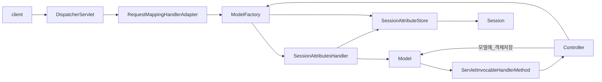

## @SessionAttribute
### 개요
* @SessionAttribute는 세션에 저장된 특정 속성을 메서드 파라미터로 가져오기 위해 사용되는 애노테이션이다.
* 세션에 저장된 속성 값을 컨트롤러의 메서드에서 직접 접근할 수 있도록 해주며 전역적으로 관리되는 세션 속성에 접근할 때 유용하게 사용할 수 있다.

#### @SessionAttribute vs HttpSession
```java
@GetMapping("/getUser")
public String getUser(@SessionAttribute(name = "user", required = false) User user) {
    if (user != null) {
        System.out.println("User from session: " + user.getName());
    } else {
        System.out.println("No user in session");
    }
}
```
````java
@GetMapping("/getUser")
public String getUser(HttpSession session) {
   User user = (User) session.getAttribute("user"); // 객체를 얻고 타입 변환
   if (user != null) {
      System.out.println("User from session: " + user.getName());
   } else {
       System.out.println("No user in session");
   }
   return "userPage"; // 사용자 정보를 보여주는 페이지로 이
}
````
* @SessionAttribute(name = "user", required = false) - 세션에 저장된 user 속성을 읽어온다.
* required = false로 설정하면 세션에 user 속성이 없을 경우 null이 반환되고 있으면 해당 속성 값에 접근해 사용자 이름을 출력한다.
* required = true(기본값)로 설정하면해당 속성이 세션에 반드시 있어야 하며 없으면 예외가 발생한다.

## RedirectAttributes & Flash Attributes
### 개요
* 웹 애플리케이션에서 페이지 이동 중 데이터 전달이 필요한 경우가 발생한다.

### 문제점
* URL에 데이터 포함
  * 보안적으로 불안정하며 사용자가 URL에서 민감한 정보를 볼 수 있다는 단점이 있다.
* 세션 사용
  * 세션을 이용하여 데이터를 전달할 수도 있지만 세션은 당므 요청 이후에도 남아 있는 데이터를 수동으로 제거해야 하며 메모리를 많이 사용할 수 있다.
* 일회성 데이터 필요
  * 많은 경우 리다이렉트 후 한 번만 사용할 데이터를 전달하는 것이 필요하다.

### RedirectAttributes & Flash Attributes 등장
* RedirectAttributes는 리다이렉트 요청 시 데이터를 안전하고 효율적으로 전달할 수 있도록 돕는 인터페이스이다.
* 리다이렉트 요청 간에 필요한 데이터를 URL에 포함할 수 있으며 FlashAttributes를 사용해서 URL에 표시되지 않도록 임시 데이터를 세션을 통해 전달할 수 도 있다.

### Post-Redirect-Get 패턴
* RedirectAttributes와 FlashAttributes는 주로 Post-Redirect-Get 패턴에 유용하게 사용되는데 사용자가 폼을 제출한 후 URL에서 폼을 다시 불러오는 대신 다른 페이지로 리다이렉트 시키는 패턴을 말한다.
* 이 패턴을 통해 중복 제출 방지 및 리다이렉트된 페이지에서 Flash Attributes를 통해 성공 또는 에러 메시지를 전달하여 사용자에게 정보를 표시할 수 있다.

### Flash Attributes
* Spring MVC는 Flash Attributes를 지원하기 위해 두 가지 추상화인 FlashMap과 FlashMapManager 제공한다. 
  * FlashMap은 플래시 속성을 저장하는 데 사용된다. 
  * FlashMapManager는 FlashMap 객체를 저장, 조회 및 관리하는 역할을 한다.

### PRG 흐름도
Post - Redirect
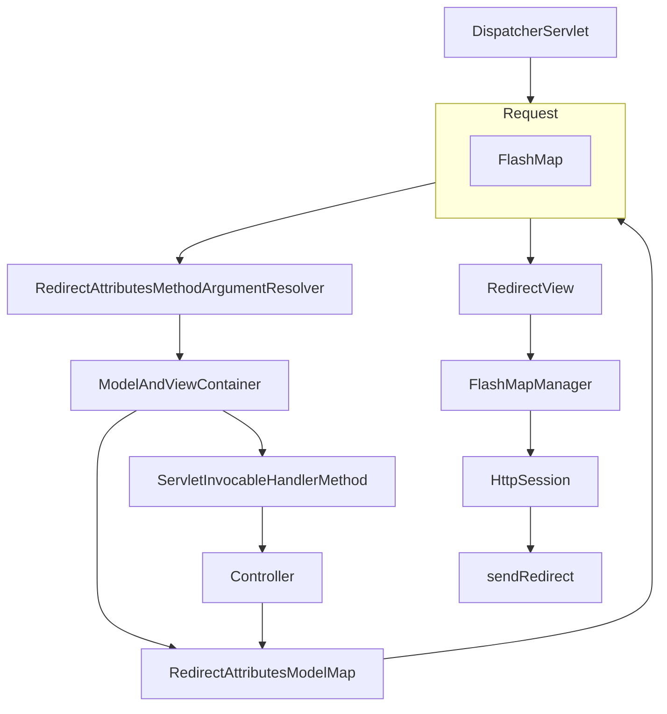

Redirect - GET
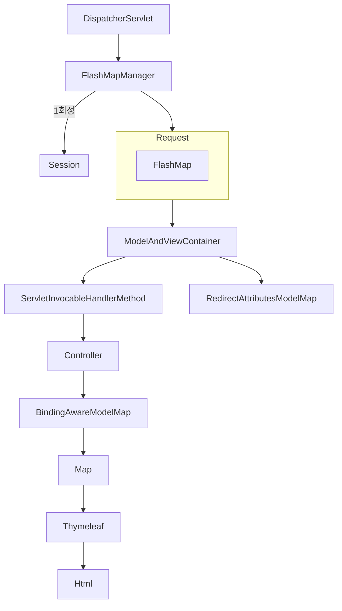

## 커스텀 HandlerMethodArgumentResolver
* @CurrentUser라는 애노테이션을 붙인 컨트롤러 파라미터에 로그인 사용자 정보를 자동으로 주입해 주는 기능을 만들고자 한다.

### 클래스 정의
1. AuthFilter
   * 필터 단계에서 인증 로직을 수행하고, 인증된 사용자 정보를 request.setAttribute에 저장한다.
2. FilterConfig
   * SpringBoot에서 AuthFilter를 등록하기 위해 FilterRegistrationBean을 설정하는 구성 클래스이다.
3. @CurrentUser
   * 컨트롤러 메서드 파라미터에 붙여, 인증된 사용자 객체를 주입받기 위한 커스텀 애노테이션이다.
4. CurrentUserArgumentResolver
   * 컨트롤러 파라미터에 @CurrentUser가 붙어 있으면, request에서 LoginUser 정보를 찾아 파라미터에 주입한다.
5. WebConfig
   * 스프링 MVC 설정을 담당하며, CurrentUserArgumentResolver를 addArgumentResolvers를 통해 등록한다.
6. LoginUser
   * 인증된 사용자의 ID, 이름 등 필요한 정보를 담는 DTO(또는 VO) 역할을 한다.
7. DemoController
   * @CurrentUser LoginUser 파라미터를 통해 자동 주입된 사용자 정보를 활용해 로직을 처리하는 예시 컨트롤러이다.

#### 처리 과정
1. 클라이언트가 HTTP 요청을 보낸다.
2. 등록된 필터(AuthFilter)가 먼저 실행되어 인증 정보를 확인한다.
3. 인증 성공 시 AuthFilter에서 LoginUser 객체를 생성해 request.setAttribute로 저장한다.
4. 필터 체인 통과 후, 스프링의 DispatcherServlet이 컨트롤러를 찾는다.
5. 스프링은 컨트롤러 파라미터를 분석해 @CurrentUser와 LoginUser 타입을 확인한다.
6. CurrentUserArgumentResolver가 request.getAttribute("LOGIN_USER")를 꺼내 파라미터에 주입한다.
7. 컨트롤러 메서드는 주입된 LoginUser 정보를 사용해 응답을 처리한다.

## DataBinder
* HTTP 요청에 대한 데이터 바인딩 방식은 크게 두 가지로 구분할 수 있는데 바로 쿼리 파라미터 및 폼 데이터 바인딩과 HTTP 본문 데이터 바인딩이다.

#### 데이터 바인딩 분류
1. 쿼리 파라미터 및 폼 데이터 바인딩
   * 기본형, 문자열, 래퍼 클래스
     * @RequestParam 적용하여 RequestParamMethodArgumentResolver가 요청 처리
     * @PathVariable 적용하여 PathVariableMethodArgumentResolver가 적용 처리
   * 객체: @ModelAttribute 적용하여 ServletModelAttributeMethodProcessor가 요청 처리
2. HTTP 본문 바인딩
   * Text, JSON: @RequestBody 적용하여 RequestResponseBodyMethodProcessor와 HttpMessageConverter가 요청 처리

#### DataBinder vs HttpMessageConverter
* DataBinder
  * 웹 요청 파라미터를 객체에 바인딩
  * 주로 폼 데이터(key-value), 쿼리 스트링, URL 패스 변수
  * 메서드의 파라미터에 @ModelAttribute을 선언해서 사용
  * 바인딩에 필요한 타입변환과 검증 과정을 거침
* HttpMessageConverter
  * HTTP 요청/응답 본문을 객체로 변환하거나 객체를 HTTP 본문으로 qusghks
  * JSON, XML, Plain Text, Binary 등 HTTP 본문 데이터
  * @RequestBody, @ResponseBody, HttpEntity, ResponseEntity 등과 함께 사용 본문 변환 후 검증 과정만 거침

#### DataBinder
* Spring의 DataBinder는 크게 3가지 특징을 가지고 있는데 바로 HTTP 요청파라미터를 객체에 바인딩 하고 타입변환 과정 및 유효성 검증을 진행하는 것이다.

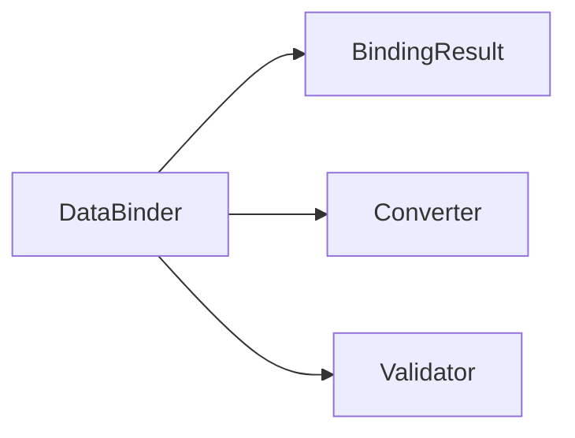
* 데이터 바인딩 - 요청 파라미터를 모델 객체의 속성에 자동으로 할당
* 타입변환 - 클라이언트의 요청 문자열로 전달된 데이터를 적절한 형식으로 변환
* 유효성 검증 - 데이터가 유효한지 확인하고, 유효성 검사 오류를 기록

#### 계층도
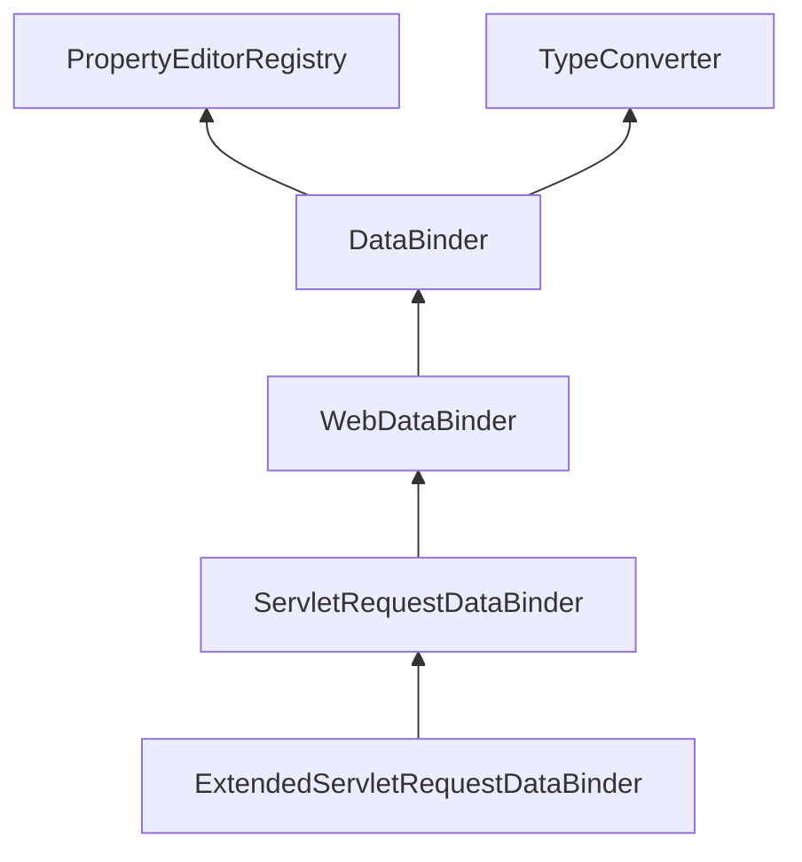

## @InitBinder
1. @InitBinder는 요청 파라미터를 객체의 속성에 바인딩할 때 데이터 바인딩 설정을 커스터마이징 하기 위한 애노테이션이다. (날짜형식,숫자 형식 등을 지정)
   * @Controller에서 @InitBinder를 사용하면 해당 컨트롤러 내에서만 적용
   * @ControllerAdvice 와 함께 사용하면 모든 컨트롤러에 적용
2. @InitBinder는 커스텀 유효성 검증기를 등록하여 검증 시 사용할 수 있다. 
3. 데이터 바인딩 시 외부 클라이언트가 필드를 임의로 설정하지 못하도록 allowedFields나 disallowedFields 설정을 통해 허용 또는 차단할 필드를 지정할 수 있다.
4. @InitBinder를 사용하여 PropertyEditor 또는 Formatter를 등록할 수 있다. 이를 통해 일반적인 데이터 변환 외에 복잡한 데이터 변환 규칙을 적용할 수 있다.

#### 메서드 선언
* @InitBinder 메서드는 보통 WebDataBinder 인수를 가지며, 리턴 값이 없는 void 타입이다.
```java
@InitBinder
public void initBinder(WebDataBinder binder) {}
```
#### WebDataBinder
* void setAllowedFields(@Nullable String... allowedFields) : 바인딩 허용 필드 설정
* void setDisallowedFields(@Nullable String... disallowedFields) : 바인딩 차단 필드 설정
* void registerCustomEditor(Class<?> requiredType, PropertyEditor propertyEditor) : 특정 데이터 타입에 대해 커스텀 변환기를 등록
* void addValidators(Validator... validators) : 커스텀 유효성 검사기 설정
* void setRequiredFields(@Nullable String... requiredFields) : 필수 필드를 지정하여 요청 파라미터에 포함되어야 함을 보장

#### @InitBinder 를 사용한 날짜 형식 지정
```java
@InitBinder
public void initBinder(WebDataBinder binder) {
    SimpleDateFormat dateFormat = new SimpleDateFormat("yyyy-MM-dd");
    dateFormat.setLenient(false); //엄격한 검사를 실행하도록 설정함
    // 날짜 형식의 변환기를 등록함
    binder.registerCustomEditor(Date.class, new CustomDateEditor(dateFormat, false));
}

@RequestMapping(value = "/submitDate", method = RequestMethod.POST) {
    if (result.hasErrors()) {
        model.addAttribute("errors", result.getAllErrors());
        return "dateForm";
    }
}
```
#### @ControllerAdvice 를 이용한 전역적 바인딩 설정
* @ControllerAdvice에 @InitBinder를 선언하면 모든 컨트롤러에서 전역적으로 데이터 바인딩 설정이 적용된다.

```java
@ControllerAdvice
public class GlobalExceptionHandler {
    
    @InitBinder
    public void initBinder(WebDataBinder binder) {
        // email 필드는 바인딩에서 제외
        binder.setDisallowedFields("email");
    }
    
    @ExceptionHandler(MethodArgumentNotValidException.class)
    @ResponseBody
    public Map<String, String> handleValidationExceptions(MethodArgumentNotValidException ex) {
        Map<String, String> errors = new HashMap<>();
        for (FieldError error : ex.getBindingResult().getFieldErrors()) {
            errors.put(error.getField(), error.getDefaultMessage());
        }
        return errors;
    }
}
```