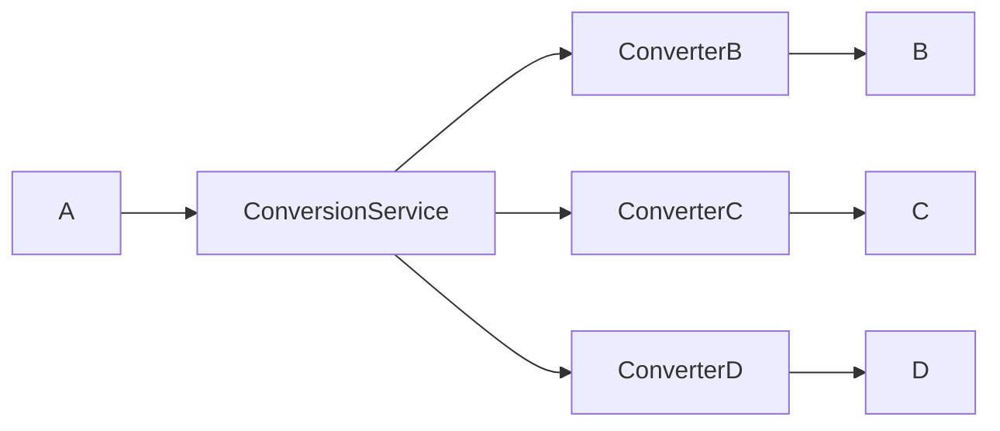
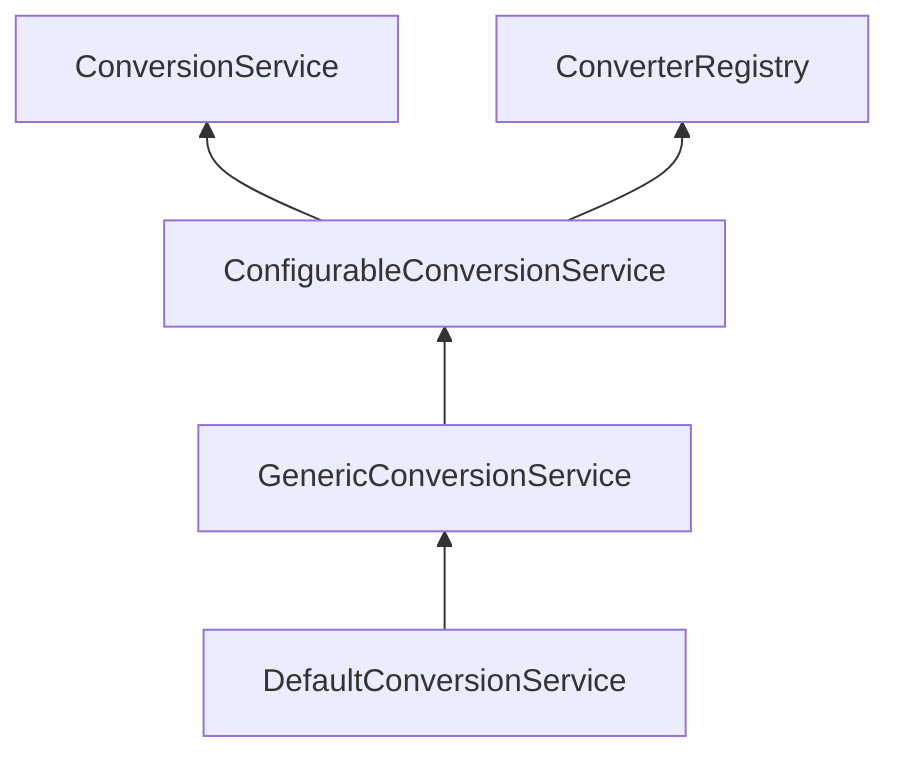

# 타입 변환 (Type Conversion)
## 개요
### 타입변환 
* 타입 변환(Type Conversion)은 데이터를 한 데이터 타입에서 다른 데이터 타입으로 변경하는 과정을 의미한다.
* 주로 서로 다른 데이터 타입 간의 호환성을 확보하거나 특정 연산을 수행하기 위해 필요하다.

### 타입 변환의 종류
* 자동 변환 (Implicit Conversion)
    * 컴파일러가 개발자의 개입 없이 자동으로 수행하는 변환.
    * 주로 작은 크기의 데이터 타입이 큰 크기의 데이터타입으로 변환될 때 사용
* 명시적 변환 (Explicit Conversion)
  * 개발자가 직접 변환을 명시해야하는 경우
  * 데이터 손실이 발생할 가능성이 있거나 타입이 다를 경우 사용한다.

## Converter
### 개요
* 타입변환은 바인딩을 처리하는 과정속에서 포함되어 있으며 타입 변환이 실패하면 더 이상 바인딩을 진행하지 않고 오류를 발생시킨다.
* Spring의 Converter<S, T>는 입력 데이터를 원하는 데이터 타입으로 변환하기 위한 인터페이스로서 소스 객체(S)를 대상 객체(T)로 변환하는 데 사용된다.
* 스프링은 이미 수많은 컨버터 구현체를 제공하고 있으며 특별한 타입이 필요한 경우 Converter를 직접 구현해서 사용할 수 있다.

### 구조
```java
public interface Converter<S, T> {
    T convert(S source);
}
```
## ConverterFactory & ConditionalConverter
### ConverterFactory
* ConverterFactory는 클래스 계층 전체를 처리하기 위한 클래스로서 변환 로직을 따로따로 작성하지 않고 하나의 공통 로직으로 처리할 수 있도록 한다.
* 예를 들어문자열(String)데이터를 다양한 열거형(Enum) 타입으로 변환해야 할 때각 열거형마다 변환기를 만들 필요 없이 변환 로직을 일관되게 관리할 수 있다.

```java
public interface ConverterFactory<S, R> {    
    <T extends R> Converter<S, T> getConverter(Class<T> targetType); // S를 R의 하위 타입인 T로 변환할 수 있는 변환기를 가져온다
}
```

### ConditionalConverter
* ConditionalConverter는 특정 조건이 참일 때만 Converter를 실행하고 싶은 경우 사용할수 있다.
* 예를 들어타겟 필드에 특정 주석이 있을 경우 Converter를 실행하거나 타겟 클래스에 특정 메서드가 정의된 경우 변환기를 실행하고 싶을 때 사용할 수 있다.

```java
public interface ConditionalConverter {
    boolean matches(TypeDescriptor sourceType, TypeDescriptor targetType);
}
```

#### TypeDescriptor
* 객체의 타입과 관련된 부가적인 정보를 표현하기 위해 사용된다. (클래스 타입 정보, 제네릭 정보, 주석(Annotation), 배열&컬렉션 요소 타입)

## ConversionService
### 개요
* Converter가 단일 변환 로직을 위한 것이라면 ConversionService는 어플리케이션 전반에서 통합된 타입 변환 서비스를 제공한다.
* ConversionService는 타입 변환과 Converter들을 등록하고 관리하는 기능을 제공하며 데이터 바인딩, 유효성 검사 등에서 통합적으로 사용하고 있다.


#### converter


#### conversionService


#### 클래스 계층도


## Converter 스프링 적용
## Formatter
## Formatting ConversionService
## Formatter 스프링 적용
## 애너테이션 기반 포맷팅